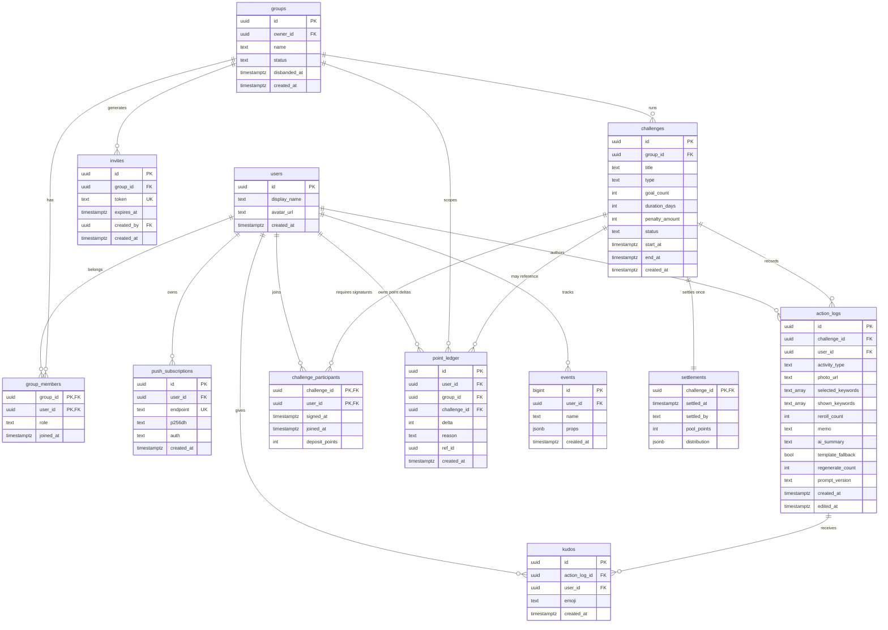
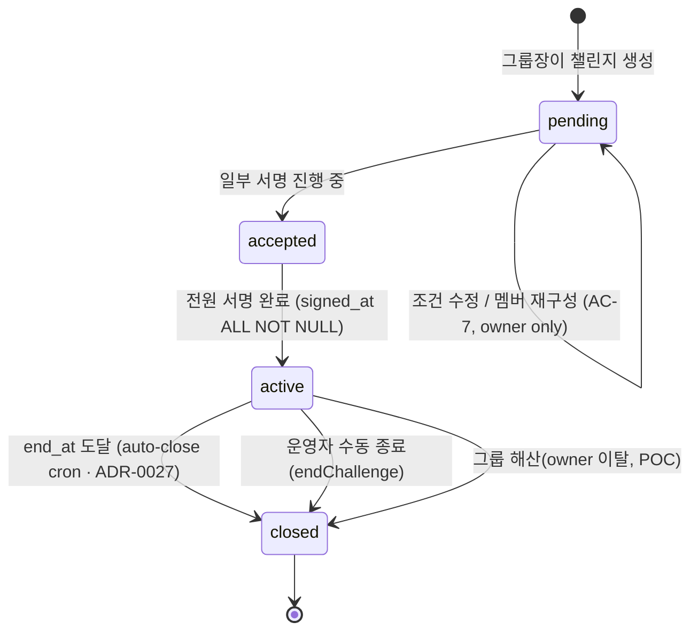

# 🗄️ [Codename: with-key] — POC Backend Schema Design

> **문서 상태**: Draft v0.1 · **작성자**: Ian · **작성일**: 2026-04-28
> **대상 독자**: BE 담당 (쟁뜌) · FE (Server Action 계약 확인) · PO · QA(상태전이 검증)
> **Pre-read**:
>
> - [PRD.md](./PRD.md) §3~§9 — 기능/AC/데이터 모델 초안 · 이벤트 스키마
> - [ONBOARDING.md](./ONBOARDING.md) §4.3, §5.4, §6.1, §6.5 — 마이그레이션 원칙 · 타입 정책 · Supabase/RLS · 이벤트 로깅
> - [DECISIONS.md](./DECISIONS.md) D-005 · D-006 · D-007 — 서약서 명칭/기간/금액
>
> **이 문서의 역할**:
>
> - PRD §8 초안을 **Day 1에 바로 마이그레이션으로 투입 가능한 수준**까지 구체화한다.
> - 테이블 · 컬럼 · 타입 · 제약 · 인덱스 · RLS 정책 · 상태 전이를 **단일 출처(SoT)** 로 정리한다.
> - ER 다이어그램 + 상태 머신 다이어그램을 제공해 FE/BE/QA가 같은 그림을 본다.
>
> **이 문서가 아닌 것**:
>
> - 완성된 DDL 원본 파일이 아님 — 본 문서 확정 후 `supabase/migrations/0001_init.sql` · `0002_rls.sql`에 반영.
> - v1 이후 확장(결제·알림톡·멀티 챌린지 타입)은 다루지 않음.

---

## 0. 설계 원칙

1. **PRD §8을 기반으로 최신 결정(D-005/006/007)을 흡수**하여 업데이트.
2. **zod 스키마(`lib/validators/*`) = 입력 레이어의 SoT**, Postgres 제약 = 저장 레이어의 SoT. 두 레이어에서 **중복 방어**(ONBOARDING §5.4).
3. **RLS 전 테이블 ON** — 그룹 멤버십(`group_members`) 기준으로 read/write 분리. 예외 없음(ONBOARDING §6.1).
4. **삭제 금지 원칙** — 인증은 수정·삭제 불가(PRD §4.3 AC-6). 논리 삭제 컬럼(`deleted_at`)도 POC에서 도입하지 않음.
5. **서버 타임 기준** — `created_at`/상태 전이 시각은 전부 `now()` 서버 값(PRD §4.3 AC-5).
6. **단방향 마이그레이션** — `down` 스크립트 없음(ONBOARDING §4.3).

---

## 1. 최신 의사결정 반영 요약

| 결정                                    | 이전 초안(PRD §8)                            | 본 문서 반영                                                                                 | 영향 컬럼/제약                                                                        |
| --------------------------------------- | -------------------------------------------- | -------------------------------------------------------------------------------------------- | ------------------------------------------------------------------------------------- |
| **D-005** "각서 → 서약서"               | 내부 식별자는 영문 `challenge`/`pledge` 유지 | 동일 — DB 식별자 영향 없음. UI 카피 이슈이므로 본 문서는 식별자 유지.                        | —                                                                                     |
| **D-006** 서약서 최대 기간 3개월        | `duration_days: 7` 고정                      | `duration_days: 1~90` 허용 (7 default). 사용자가 종료일 picker 로 선택 — 최소 1주 (ADR-0004) | `challenges.duration_days CHECK (1..90)`                                              |
| **D-007** 최대 금액 10,000원 + 0원 허용 | `penalty_amount 1,000~20,000`                | `penalty_amount 0~10,000`                                                                    | `challenges.penalty_amount CHECK (0..10000 & %1000=0)` ← **migration 0025 적용 완료** |

> ✅ **2026-05-15 업데이트**: PRD §3.3 AC-1, [src/lib/validators/challenge.ts](src/lib/validators/challenge.ts), DB CHECK 모두 D-006/D-007에 정합. `supabase/migrations/0025_penalty_allow_zero.sql`이 PR5(#45)에 함께 머지되며 0001_init.sql의 `BETWEEN 1000 AND 10000` 제약을 `BETWEEN 0 AND 10000`으로 완화. 1000원 단위 제약은 유지.

---

## 2. 테이블 인벤토리 (12개)

| #   | 테이블                   | 목적                                            | PRD 근거      |
| --- | ------------------------ | ----------------------------------------------- | ------------- |
| 1   | `users`                  | 표시명·아바타 (auth.users 확장)                 | §8.2          |
| 2   | `groups`                 | 단톡방에서 들어온 친구 그룹 (3~4명) + 해산 상태 | §3, §3.4 Edge |
| 3   | `group_members`          | 유저↔그룹 N:M + role(owner/member)              | §3.3 AC-4     |
| 4   | `invites`                | 초대 토큰 · 72h 만료                            | §3.3 AC-2     |
| 5   | `challenges`             | 서약서 본문(제목·횟수·기간·금액) + 상태         | §3, §8.2      |
| 6   | `challenge_participants` | 서명/참여 여부, `signed_at`                     | §3.3 AC-3/5   |
| 7   | `point_ledger`           | append-only 포인트 원장, 잔액=`SUM(delta)`      | §5.C P1       |
| 8   | `settlements`            | 챌린지별 불변 정산 스냅샷                       | §5.C P1       |
| 9   | `action_logs`            | 사진+종류+키워드칩 인증 **+ AI 일기 결과 흡수** | §4, §5, §8.2  |
| 10  | `kudos`                  | 3고정 이모지 응원(토글)                         | §7, §8.2      |
| 11  | `push_subscriptions`     | Web Push 구독 토큰                              | §6            |
| 12  | `events`                 | 분석 이벤트 로그(§9) · AI 비용 추적 포함        | §9            |

> 신규 추가: `invites` · `events` (PRD §8.1 명시 9종 외 운영 필수), `point_ledger` · `settlements` (P1 포인트 정산 실데이터).
> **제외(POC out of scope)**:
>
> - `ai_cost_log` — 규모 불필요. `events(name='ai_generated')` 집계로 대체. → §13 v1 백로그.
> - `feed_items` — `action_logs`와 사실상 1:1이라 POC에서는 AI 결과 컬럼을 `action_logs`로 흡수. → §13 v1 백로그(분리 조건 명시).

---

## 3. ER 다이어그램



---

## 4. 상태 머신 — `challenges.status`



- `pending → accepted`: 서명 1건이라도 존재하면 전이 (UI 피드백용 구분).
- `accepted → active`: 전원 서명 + 서버에서 `start_at = now()`, `end_at = (활성화 KST 날짜 + duration_days)일의 00:00 KST` 계산 (ADR-0026 — KST 자정 정렬, 신규 활성화부터).
- **서명 거부 시** (PRD §3.4 Edge): 상태 전이 없이 `pending` 유지. 그룹장이 해당 멤버를 `challenge_participants`에서 제외 후 재시도 (`pending → pending`).
- `active` 이후 멤버 freeze(AC-6). 조건·기간·금액 수정 불가.
- `active → closed` (만기): **표시는 `challengePhase`(status + end_at) 파생**이라 만기(end_at ≤ now) 즉시 "종료/정산 대기"로 보인다(ADR-0027). DB `status` 전이는 `deadline-push` cron 의 **auto-close**(`UPDATE challenges SET status='closed' WHERE status='active' AND end_at<=now()`)가 KST 09:00 경 수행 — 0029 슬롯 해제·status truthful 화. 운영자 수동 종료(`endChallenge`)도 동일 결과. 만기~cron 사이 제출·좋아요는 게이트·RLS(`now() between start_at and end_at`)가 이미 차단.

---

## 5. 컬럼 상세

### 5.1 `users`

| 컬럼           | 타입        | Null | Default | 제약/비고                                             |
| -------------- | ----------- | ---- | ------- | ----------------------------------------------------- |
| `id`           | uuid        | NO   | —       | PK, **FK → `auth.users(id)` ON DELETE CASCADE** (1:1) |
| `display_name` | text        | NO   | —       | `char_length BETWEEN 1 AND 20`                        |
| `avatar_url`   | text        | YES  | null    | URL 형식은 앱단 검증                                  |
| `created_at`   | timestamptz | NO   | `now()` |                                                       |

- **auth_provider 제거**: Supabase `auth.users.identities` 에서 provider 조회 가능. public 테이블 복제 불필요. 조회 편의상 뷰가 필요하면 v1에서 추가(§13).

### 5.2 `groups`

| 컬럼           | 타입        | Null | Default             | 제약/비고                                                             |
| -------------- | ----------- | ---- | ------------------- | --------------------------------------------------------------------- |
| `id`           | uuid        | NO   | `gen_random_uuid()` | PK                                                                    |
| `owner_id`     | uuid        | NO   | —                   | FK → `users.id`                                                       |
| `name`         | text        | YES  | null                | 1~30자 (`char_length <= 30`) · POC는 optional                         |
| `status`       | text        | NO   | `'active'`          | `CHECK IN ('active','disbanded')` — PRD §3.4 Edge: owner 이탈 시 해산 |
| `disbanded_at` | timestamptz | YES  | null                | `status='disbanded'` 전이 시 `now()`                                  |
| `created_at`   | timestamptz | NO   | `now()`             |                                                                       |

### 5.3 `group_members`

| 컬럼        | 타입        | Null | Default    | 제약/비고                     |
| ----------- | ----------- | ---- | ---------- | ----------------------------- |
| `group_id`  | uuid        | NO   | —          | PK, FK → `groups.id`          |
| `user_id`   | uuid        | NO   | —          | PK, FK → `users.id`           |
| `role`      | text        | NO   | `'member'` | `CHECK IN ('owner','member')` |
| `joined_at` | timestamptz | NO   | `now()`    |                               |

- 그룹당 멤버 수 **3~4명**(PRD AC-4)은 **앱 레이어에서 검증**. DB CHECK는 불가(그룹 단위 집계 제약 비현실적).

### 5.4 `invites`

| 컬럼         | 타입        | Null | Default                       | 제약/비고                          |
| ------------ | ----------- | ---- | ----------------------------- | ---------------------------------- |
| `id`         | uuid        | NO   | `gen_random_uuid()`           | PK                                 |
| `group_id`   | uuid        | NO   | —                             | FK → `groups.id` ON DELETE CASCADE |
| `token`      | text        | NO   | —                             | UNIQUE, 랜덤 32바이트 base64       |
| `expires_at` | timestamptz | NO   | `now() + interval '72 hours'` | PRD AC-2                           |
| `created_by` | uuid        | NO   | —                             | FK → `users.id` (owner)            |
| `created_at` | timestamptz | NO   | `now()`                       |                                    |

### 5.5 `challenges` ⭐ (D-006/007 반영)

| 컬럼             | 타입        | Null | Default             | 제약/비고                                                                                                                                                                        |
| ---------------- | ----------- | ---- | ------------------- | -------------------------------------------------------------------------------------------------------------------------------------------------------------------------------- |
| `id`             | uuid        | NO   | `gen_random_uuid()` | PK                                                                                                                                                                               |
| `group_id`       | uuid        | NO   | —                   | FK → `groups.id`                                                                                                                                                                 |
| `title`          | text        | NO   | —                   | `char_length BETWEEN 1 AND 30`                                                                                                                                                   |
| `type`           | text        | NO   | `'fitness'`         | `CHECK IN ('fitness')` — POC                                                                                                                                                     |
| `goal_count`     | int         | NO   | `3`                 | `CHECK BETWEEN 1 AND 7` — 주 N회(주간 빈도). 벌금은 끝난 주마다 미달 시 누적(`lib/challenge/weekly.ts`)                                                                          |
| `duration_days`  | int         | NO   | `7`                 | `CHECK BETWEEN 1 AND 90` ← **D-006**. 사용자 종료일 picker 로 7~90일 선택 (최소 1주 — [ADR-0004](./adr/0004-2026-05-14-end-date-picker-min-week.md), PR5 머지 후 FE 가드 해제됨) |
| `penalty_amount` | int         | NO   | —                   | `CHECK BETWEEN 0 AND 10000 AND penalty_amount % 1000 = 0` ← **D-007** (migration 0025_penalty_allow_zero.sql에서 0원 허용으로 완화됨, PR #45)                                    |
| `status`         | text        | NO   | `'pending'`         | `CHECK IN ('pending','accepted','active','closed')`                                                                                                                              |
| `start_at`       | timestamptz | YES  | null                | `active` 전이 시 서버가 `now()`로 채움                                                                                                                                           |
| `end_at`         | timestamptz | YES  | null                | (활성화 KST 날짜 + duration_days)일의 00:00 KST — ADR-0026                                                                                                                       |
| `created_at`     | timestamptz | NO   | `now()`             |                                                                                                                                                                                  |

- **그룹당 동시 1개 제약**: partial unique index `challenges_one_open_per_group on challenges(group_id) where status in ('pending','accepted','active')` (migration 0029). closed 는 제외하여 종료 챌린지 history 누적 보존.
- `created_by` 컬럼은 POC 에서 추가하지 않음 — owner=creator 모델 유지 (ADR-0011).
- **`closed_at timestamptz null`** (migration 0041, 2026-06-02): 종료(closed) 시각. 조기 종료 정산 cutoff 산정용 — [ADR-0030](./adr/0030-early-close-settlement-cutoff.md). NULL=미종료 또는 레거시(폴백 `duration_days`). 종료 경로 둘(`endChallenge` Server Action · auto-close cron)이 `status='closed'` 전이와 함께 `now()`로 set. CHECK·RLS 무변경.

### 5.6 `challenge_participants`

| 컬럼             | 타입        | Null | Default | 제약/비고                                                                               |
| ---------------- | ----------- | ---- | ------- | --------------------------------------------------------------------------------------- |
| `challenge_id`   | uuid        | NO   | —       | PK, FK → `challenges.id`                                                                |
| `user_id`        | uuid        | NO   | —       | PK, FK → `users.id`                                                                     |
| `signed_at`      | timestamptz | YES  | null    | `NULL = 미서명`, 값 존재 = 서명 완료                                                    |
| `joined_at`      | timestamptz | NO   | `now()` |                                                                                         |
| `deposit_points` | int         | NO   | `0`     | 보증금 hold 금액의 게이지 read용 denormalized cache. `CHECK >= 0`. SoT는 `point_ledger` |

- 전원 서명 판별: `COUNT(*) FILTER (WHERE signed_at IS NULL) = 0`.
- `deposit_points`는 `signed_at` self-update 정책에 우발적으로 노출되지 않도록 BEFORE INSERT/UPDATE 트리거가 service_role 외 변경을 차단한다(migration 0042).

### 5.6.1 `point_ledger`

Append-only 포인트 원장. 잔액 컬럼은 두지 않고, 표시 잔액은 항상 `user_id + group_id` 스코프의 `SUM(delta)`로 도출한다(ADR-0032, `AC-deposit-hold-5`).

| 컬럼           | 타입        | Null | Default             | 제약/비고                                                                                   |
| -------------- | ----------- | ---- | ------------------- | ------------------------------------------------------------------------------------------- |
| `id`           | uuid        | NO   | `gen_random_uuid()` | PK                                                                                          |
| `user_id`      | uuid        | NO   | —                   | FK → `users.id`                                                                             |
| `group_id`     | uuid        | NO   | —                   | FK → `groups.id`                                                                            |
| `challenge_id` | uuid        | YES  | null                | FK → `challenges.id`, 가입/번들 지급처럼 챌린지와 무관한 행은 NULL 허용                     |
| `delta`        | int         | NO   | —                   | signed point delta, `CHECK (delta <> 0)`                                                    |
| `reason`       | text        | NO   | —                   | `bundle_grant` · `deposit_hold` · `deposit_release` · `penalty` · `distribution` · `refund` |
| `ref_id`       | uuid        | YES  | null                | 원천 행(`settlements.challenge_id`, RPC idempotency key 등) 추적용                          |
| `created_at`   | timestamptz | NO   | `now()`             |                                                                                             |

- 인덱스: `(user_id, group_id, created_at desc)`, `(group_id, created_at desc)`, partial `challenge_id`, partial `ref_id`.
- RLS: 본인(`user_id=auth.uid()`) 또는 같은 그룹 멤버 read. INSERT/UPDATE/DELETE 정책 없음.
- 가드 트리거: service_role 외 INSERT는 `42501`, UPDATE/DELETE는 append-only 위반으로 `42501`.

### 5.6.2 `settlements`

챌린지별 불변 정산 스냅샷. `challenge_id`를 PK로 두어 이중 정산을 스키마 레벨에서 차단한다(`AC-settle-trigger-3`).

| 컬럼           | 타입        | Null | Default       | 제약/비고                                        |
| -------------- | ----------- | ---- | ------------- | ------------------------------------------------ |
| `challenge_id` | uuid        | NO   | —             | PK, FK → `challenges.id`                         |
| `settled_at`   | timestamptz | NO   | `now()`       | 정산 확정 시각                                   |
| `settled_by`   | text        | NO   | —             | `CHECK IN ('owner','auto')`                      |
| `pool_points`  | int         | NO   | —             | 그룹 공동 주머니로 이월되는 포인트, `CHECK >= 0` |
| `distribution` | jsonb       | NO   | `'{}'::jsonb` | 확정 시점 분배 스냅샷. 사후 재계산하지 않음      |

- RLS: 연결된 `challenges.group_id`의 그룹 멤버 read. INSERT/UPDATE/DELETE 정책 없음.
- 가드 트리거: service_role 외 INSERT는 `42501`, UPDATE/DELETE는 불변 스냅샷 위반으로 `42501`.

### 5.7 `action_logs` ⭐ (AI 일기 흡수)

| 컬럼                        | 타입        | Null | Default             | 제약/비고                                                                                                                                                                                                             |
| --------------------------- | ----------- | ---- | ------------------- | --------------------------------------------------------------------------------------------------------------------------------------------------------------------------------------------------------------------- |
| `id`                        | uuid        | NO   | `gen_random_uuid()` | PK                                                                                                                                                                                                                    |
| `challenge_id`              | uuid        | NO   | —                   | FK → `challenges.id`                                                                                                                                                                                                  |
| `user_id`                   | uuid        | NO   | —                   | FK → `users.id`                                                                                                                                                                                                       |
| `activity_type`             | text        | NO   | —                   | `CHECK IN ('running','gym','yoga','other')`                                                                                                                                                                           |
| `photo_url`                 | text        | NO   | —                   | Storage pre-signed key                                                                                                                                                                                                |
| `selected_keywords`         | text[]      | NO   | —                   | `array_length BETWEEN 1 AND 3`(빈 배열은 `array_length`=NULL→CHECK 통과, 직접 입력 일기) · **풀 검증은 앱(zod) 레이어**(PRD AC-10)                                                                                    |
| `shown_keywords`            | text[]      | NO   | —                   | 재현·분석용 스냅샷(노출된 칩 전체)                                                                                                                                                                                    |
| `reroll_count`              | int         | NO   | `0`                 | `CHECK BETWEEN 0 AND 5` (PRD AC-9)                                                                                                                                                                                    |
| `memo`                      | text        | YES  | null                | `char_length <= 100` (escape hatch)                                                                                                                                                                                   |
| `ai_summary`                | text        | NO   | —                   | `char_length <= 150` · 3~5줄(앱 검증) — AI 또는 템플릿 폴백 결과                                                                                                                                                      |
| `template_fallback`         | bool        | NO   | `false`             | AI 실패 시 true (PRD §5.3 AC-8)                                                                                                                                                                                       |
| `regenerate_count`          | int         | NO   | `0`                 | `CHECK BETWEEN 0 AND 2` (PRD AC-5)                                                                                                                                                                                    |
| `prompt_version`            | text        | NO   | —                   | `lib/ai/prompts.ts`의 `PROMPT_VERSION` — 이벤트와 조인 분석용 · 직접 입력은 `'manual'`                                                                                                                                |
| `created_at`                | timestamptz | NO   | `now()`             | 서버 타임 (AC-5)                                                                                                                                                                                                      |
| `edited_at`                 | timestamptz | YES  | null                | 5분 이내 편집 시에만 세팅(AC-7)                                                                                                                                                                                       |
| `auto_verify_status`        | text        | NO   | `'passed'`          | `CHECK IN ('pending','passed','failed','manual_review','peer_rejected')` · 기본 passed(친구 신뢰) · **서버 전용**(검증 RPC/service_role) · `peer_rejected`=WP5 다수결 반려(카운트 제외) — migration 0045, ADR-0032 §4 |
| `auto_verify_score`         | numeric     | YES  | null                | 결정론 부정 신호 점수(메타) · **서버 전용** · 사진/일기 본문 미저장                                                                                                                                                   |
| `auto_verify_model_version` | text        | YES  | null                | 검증 로직/모델 버전 marker(이벤트 조인 분석용) · **서버 전용**                                                                                                                                                        |
| `photo_phash`               | text        | YES  | null                | perceptual hash — 사진 재사용·중복 검출 메타(AC-cheat-detect-1) · 원본 미저장 · **서버 전용**                                                                                                                         |
| `photo_captured_at`         | timestamptz | YES  | null                | EXIF 촬영시각 — 촬영-제출 시각 불일치 신호용 메타 · **서버 전용**                                                                                                                                                     |

- **자동검증 컬럼군**([ADR-0032 §4](adr/0032-settlement-verification-data-model.md) · migration 0045): 위 5개는 모두 **서버 write 전용**. AI 컬럼처럼 `prevent_ai_column_update` 가드가 클라(anon/authenticated) 직접 UPDATE 위조를 `42501`로 거부하고, 검증 status 의 사후 UPDATE(비동기 확정·override)는 서버 경로(service_role 또는 SECURITY DEFINER 검증 RPC)에서만 가능하다. INSERT 시엔 default(`status='passed'`, 나머지 NULL)로 시작하고 판정 RPC(WP2)가 채운다 — 메타(신호·점수·버전)만 저장하고 본문은 적재하지 않는다.
- **본문 immutability**(migration 0045): `prevent_action_log_body_mutation` BEFORE UPDATE 트리거가 본문(`challenge_id`·`user_id`·`activity_type`·`selected_keywords`·`shown_keywords`·`reroll_count`·`memo`·`created_at`) 변경을 모든 role 에서 `42501`로 거부한다. **예외 2가지만**: ① 검증 status 컬럼군 서버 UPDATE(위 가드가 허용) ② 마감 전 사진 교체(`photo_path`). 사진 교체의 '마감 전·1회' 한정과 부정탐지 재실행은 WP4(EVAL-0024).
- **`counted` 컬럼 제거**: POC 전체 로그 ~30건 규모에서 트리거+타임존 하드코딩 비용이 집계 쿼리보다 크다. "1일 1회 카운트"(AC-4)는 조회 시 `COUNT(DISTINCT date_trunc('day', created_at AT TIME ZONE 'Asia/Seoul'))` 집계로 처리. 집계 헬퍼는 `lib/challenge/done-days.ts`(KST distinct day)에 통일, 주 단위 벌금 누적 평가는 `lib/challenge/weekly.ts`. → v1에서 트래픽 증가 시 재검토(§13).
- **AI 일기 결과 흡수**: `feed_items` 별도 테이블 폐지. JOIN 없이 단일 SELECT로 피드 렌더링.
- **직접 입력 일기**([spec 2026-05-28-action-manual-diary](superpowers/specs/2026-05-28-action-manual-diary.md)): `memo` 가 채워진 제출은 AI 를 건너뛰고 입력 글을 `ai_summary` 에 그대로 저장한다(`prompt_version='manual'` · `template_fallback=false` · `selected_keywords=[]` · `memo` 컬럼 null). 빈 `selected_keywords` 는 `array_length`=NULL 로 기존 CHECK 를 통과하므로 마이그레이션이 필요 없다.

### 5.8 `kudos`

| 컬럼            | 타입        | Null | Default             | 제약/비고                   |
| --------------- | ----------- | ---- | ------------------- | --------------------------- |
| `id`            | uuid        | NO   | `gen_random_uuid()` | PK                          |
| `action_log_id` | uuid        | NO   | —                   | FK → `action_logs.id`       |
| `user_id`       | uuid        | NO   | —                   | FK → `users.id`             |
| `emoji`         | text        | NO   | —                   | `CHECK IN ('🔥','💪','👏')` |
| `created_at`    | timestamptz | NO   | `now()`             |                             |

- **UNIQUE `(action_log_id, user_id, emoji)`** — 같은 이모지 1회만(토글은 UPSERT/DELETE로 처리, PRD AC-2, §7.4).
- 본인 인증 kudos 금지(AC-4)는 **앱 레이어 + RLS 정책**에서 방어(§7 참고).

### 5.9 `push_subscriptions`

| 컬럼         | 타입        | Null | Default             | 제약/비고                           |
| ------------ | ----------- | ---- | ------------------- | ----------------------------------- |
| `id`         | uuid        | NO   | `gen_random_uuid()` | PK                                  |
| `user_id`    | uuid        | NO   | —                   | FK → `users.id` ON DELETE CASCADE   |
| `endpoint`   | text        | NO   | —                   | UNIQUE — 동일 기기 재구독 시 upsert |
| `p256dh`     | text        | NO   | —                   | VAPID 구독 키                       |
| `auth`       | text        | NO   | —                   | VAPID auth secret                   |
| `created_at` | timestamptz | NO   | `now()`             |                                     |

### 5.10 `events` (분석)

| 컬럼         | 타입        | Null | Default  | 제약/비고                            |
| ------------ | ----------- | ---- | -------- | ------------------------------------ |
| `id`         | bigint      | NO   | identity | PK                                   |
| `user_id`    | uuid        | YES  | null     | 익명 이벤트 허용(`invite_opened` 등) |
| `name`       | text        | NO   | —        | PRD §9.1 이벤트 명과 1:1             |
| `props`      | jsonb       | NO   | `'{}'`   | 이벤트별 속성                        |
| `created_at` | timestamptz | NO   | `now()`  |                                      |

- 인덱스: `(name, created_at DESC)`.
- 이벤트 화이트리스트는 **앱 레이어(`lib/analytics/track.ts`의 `AnalyticsEvent` union)에서 TS 타입으로 강제**. DB CHECK는 두지 않음(이벤트 추가마다 마이그레이션 부담).
- **AI 비용 추적은 본 테이블의 `ai_generated` 이벤트 집계로 대체** (`props` 에 `tokens`/`latencyMs`/`fallback` 포함). POC 규모(50~100건) 에서 별도 `ai_cost_log` 불필요. v1 재검토.

---

## 6. 인덱스 세트

PRD §8.3을 기준으로 본 문서에서 확정:

| 인덱스                                                                                                         | 용도                                                                |
| -------------------------------------------------------------------------------------------------------------- | ------------------------------------------------------------------- |
| `idx_challenges_group_status` ON `challenges(group_id, status)`                                                | 그룹의 활성 챌린지 조회                                             |
| `idx_action_logs_challenge_user_created` ON `action_logs(challenge_id, user_id, created_at DESC)`              | 주간 목표 집계                                                      |
| `idx_action_logs_user_created` ON `action_logs(user_id, created_at DESC)`                                      | "오늘 인증 여부" 조회                                               |
| `idx_kudos_action_log` ON `kudos(action_log_id)`                                                               | 피드 카드당 카운트                                                  |
| `idx_action_logs_keywords_gin` ON `action_logs USING GIN (selected_keywords)`                                  | Week 2 키워드 분포 분석                                             |
| `idx_events_name_created` ON `events(name, created_at DESC)`                                                   | 이벤트 집계(§9)                                                     |
| `idx_invites_token` ON `invites(token)`                                                                        | 초대 링크 조회                                                      |
| `idx_push_sub_user` ON `push_subscriptions(user_id)`                                                           | 발송 대상 조회                                                      |
| `idx_point_ledger_user_group_created` ON `point_ledger(user_id, group_id, created_at DESC)`                    | user/group 잔액·이력 조회                                           |
| `idx_point_ledger_group_created` ON `point_ledger(group_id, created_at DESC)`                                  | 그룹 정산 투명성 조회                                               |
| `idx_point_ledger_challenge` ON `point_ledger(challenge_id) WHERE challenge_id IS NOT NULL`                    | 챌린지 관련 원장 조회                                               |
| `idx_point_ledger_ref` ON `point_ledger(ref_id) WHERE ref_id IS NOT NULL`                                      | 원천 행/idempotency 추적                                            |
| `ux_point_ledger_deposit_hold` (UNIQUE) ON `point_ledger(user_id, challenge_id) WHERE reason = 'deposit_hold'` | (user, challenge)당 hold 1행 강제 — 동시 호출 중복 hold 차단 (0044) |
| `idx_settlements_settled_at` ON `settlements(settled_at DESC)`                                                 | 최근 정산 조회                                                      |

---

## 7. RLS 정책 요약

> 원칙: **전 테이블 ON**. 기본 deny. 헬퍼 함수 `is_group_member(gid)` 를 두고 재사용.

```sql
-- 헬퍼 (pseudo)
create or replace function is_group_member(gid uuid) returns boolean
language sql stable as $$
  select exists(
    select 1 from group_members
    where group_id = gid and user_id = auth.uid()
  );
$$;
```

| 테이블                   | SELECT                              | INSERT                                                                           | UPDATE                                                                        | DELETE                             |
| ------------------------ | ----------------------------------- | -------------------------------------------------------------------------------- | ----------------------------------------------------------------------------- | ---------------------------------- |
| `users`                  | self + 같은 그룹 멤버               | self only                                                                        | self only (display_name/avatar)                                               | ❌                                 |
| `groups`                 | 멤버만                              | 인증된 사용자 (owner = self)                                                     | owner만 (name, status→'disbanded')                                            | ❌ POC                             |
| `group_members`          | 멤버만                              | 초대 수락 Server Action 경유(service role)                                       | ❌                                                                            | owner 또는 self (탈퇴)             |
| `invites`                | 그룹 owner + 토큰 정확 일치 시 anon | owner only                                                                       | ❌                                                                            | owner only                         |
| `challenges`             | 그룹 멤버                           | 그룹 owner                                                                       | owner AND status='pending'                                                    | ❌                                 |
| `challenge_participants` | 그룹 멤버                           | service role/RPC only                                                            | self (`signed_at` 채움, `deposit_points`는 trigger로 서버 전용)               | ❌                                 |
| `point_ledger`           | 본인 또는 그룹 멤버                 | ❌ 정책 없음(RPC/server only)                                                    | ❌ 정책 없음 + append-only trigger                                            | ❌ 정책 없음 + append-only trigger |
| `settlements`            | 그룹 멤버                           | ❌ 정책 없음(RPC/server only)                                                    | ❌ 정책 없음 + immutable trigger                                              | ❌ 정책 없음 + immutable trigger   |
| `action_logs`            | 그룹 멤버                           | self AND 챌린지 active (AI·검증 컬럼은 서버만)                                   | self AND 5분 이내(본문 immutable, `photo_path`만 교체; AI·검증 컬럼은 서버만) | ❌ (AC-6)                          |
| `kudos`                  | 그룹 멤버                           | self AND 본인 action_log 금지 AND 같은 그룹 멤버                                 | ❌                                                                            | self (토글 취소)                   |
| `push_subscriptions`     | self                                | self                                                                             | self                                                                          | self                               |
| `events`                 | 서버만                              | self(`user_id=auth.uid()`) 또는 anon(`user_id IS NULL`) — 클라이언트 이벤트 허용 | ❌                                                                            | ❌                                 |

**방어 이중화 포인트**:

- `kudos` 본인 action_log 금지: RLS 정책 + zod 검증 + 앱 레이어 3중.
- 5분 내 편집 제한: UPDATE 정책에서 `created_at > now() - interval '5 minutes'`.
- `challenges` `status` 전이: UPDATE 정책에서 status 전환 조건부(pending→pending 수정만 허용; accepted/active/closed 전이는 Server Action + service role).
- `point_ledger`/`settlements`: SELECT만 열고 write 정책을 두지 않는다. 직접 클라(anon/authenticated) INSERT는 BEFORE trigger가 `42501`, UPDATE/DELETE는 원장 append-only·스냅샷 immutable 위반으로 `42501`. **write 허용 경로는 둘**: ① service_role 직접 write(BFF/cron) ② `SECURITY DEFINER` 정산 RPC(트리거 시점 `current_user`가 함수 소유자라 `anon`/`authenticated`가 아님). 0044가 가드를 이 2경로 허용으로 보강 — 0042/0043의 `request.jwt.claims='service_role'` 단독 검사로는 authenticated 그룹장의 `settle_challenge` 호출이 막혔다.
- `challenge_participants.deposit_points`: 기존 self UPDATE 정책은 서명용으로 유지하되, 보증금 cache 컬럼 변경은 BEFORE trigger가 차단(허용 경로: service_role 또는 SECURITY DEFINER RPC, 위와 동일).
- `action_logs.ai_summary`/`template_fallback`/`regenerate_count`/`prompt_version`: 클라이언트 INSERT/UPDATE 시 컬럼 차단 — column-level RLS 또는 Server Action 단일 경로 강제.
- `action_logs` 검증 컬럼군(`auto_verify_status`/`auto_verify_score`/`auto_verify_model_version`/`photo_phash`/`photo_captured_at`): `prevent_ai_column_update` 가드를 확장(0045)해 클라 직접 UPDATE 위조를 `42501`로 차단. 허용 경로는 정산 가드(0044)와 동일한 2경로 — ① service_role 직접 write ② `SECURITY DEFINER` 검증 RPC(`current_user`가 함수 소유자). 이로써 검증 status 의 사후 UPDATE(immutability 예외 ①)는 서버만 가능하다.
- `action_logs` 본문 immutability(0045): `prevent_action_log_body_mutation` BEFORE UPDATE 트리거가 본문 컬럼 변경을 모든 role 에서 `42501`로 거부. **예외 2가지만** — ① 검증 status 컬럼군 서버 UPDATE ② 마감 전 사진 교체(`photo_path`). 기존 `al_update_self_5min`(본인 5분 창) 정책은 유지하되, 그 창 안에서도 변경 가능 컬럼은 `photo_path` 로 좁아진다(키워드/memo 도 불변).
- `events` INSERT 완화 배경: PRD §9.1 중 `keywords_shown`/`keywords_reroll`/`keyword_selected`/`memo_fallback_opened`/`feed_view`/`notification_opened` 6종은 클라이언트 전용이라 Server Action 왕복 없이 직접 insert 허용. **서버 이벤트**(AI 성공/실패·알림 발송 등)는 여전히 서버에서 track.

---

## 8. 상태 전이·부수효과 — Server Action 계약

> 아래는 Server Action(`_actions.ts`)이 반드시 처리해야 할 원자적 작업. 트랜잭션 필요.

### 8.1 `createChallenge(input)`

- 입력 검증: `challengeInputSchema` (D-006/007 반영 후)
- 구현: SECURITY DEFINER RPC `create_challenge(p_group_id, p_title, p_type, p_goal_count, p_duration_days, p_penalty_amount)` (migration `0021_create_challenge_rpc.sql`)
- owner 검증 → `challenges(status='pending')` 삽입 → `challenge_participants` 에 **현재 `group_members` 전원** 시드(`signed_at=null`) 를 한 트랜잭션으로 처리. 이후 친구가 `acceptInvite` 로 합류하면 `accept_invite` RPC 가 pending 챌린지에 자동 편입(§8.3).
- 반환: `(id uuid, participant_count int)` — `participant_count` 는 시드 직후 카운트. cohort 분리(솔로 1 / 그룹 ≥2)와 이벤트 props 에 사용.
- 백필: 0021 마이그레이션이 멱등(`ON CONFLICT DO NOTHING`)으로 기존 pending 챌린지의 누락된 참가자 시드를 보정.
- 이벤트: `challenge_created`

### 8.2 `createInvite(groupId)`

- owner 확인 → `invites` 삽입 (72h 만료)
- 이벤트: `invite_sent`

### 8.3 `acceptInvite(token)`

- 토큰 유효 검증(만료·소비 여부) → `group_members` upsert → (현재 `pending` 챌린지에) `challenge_participants` 삽입
- 4명 초과 차단(그룹 멤버 COUNT < 4)
- 이벤트: `invite_opened`(조회) · `user_signed_up`(신규)

### 8.4 `signPledge(challengeId)`

- `challenge_participants.signed_at = now()` (self)
- 전원 서명 시 **원자적으로** `challenges.status = 'active'`, `start_at = now()`, `end_at = (활성화 KST 날짜 + duration_days)일의 00:00 KST` (ADR-0026)
- 이벤트: `challenge_signed` · (전원) `challenge_activated` · 시작 푸시 발송

### 8.5 `submitActionLog(input)`

- 입력 검증: `actionLogInputSchema` (키워드 풀 포함 검증)
- 챌린지 active + 기간 내 확인
- **단일 트랜잭션**에서 `lib/ai/diary.ts` 호출 → `action_logs` 삽입(AI 결과 컬럼 포함)
  - AI 실패 시 `template_fallback=true` + 키워드 활용 템플릿을 `ai_summary`에 기록
- "1일 1회 카운트"(AC-4)는 저장 시 계산하지 않고 **조회 시 집계**(`lib/challenge/done-days.ts` — KST distinct day. 주 단위 누적은 `weekly.ts`)
- 이벤트: `action_logged` · `ai_generated`

### 8.6 `giveKudos(actionLogId, emoji)`

- self action_log 금지 · 그룹 멤버 확인
- UPSERT/DELETE 토글 (UNIQUE `(action_log_id, user_id, emoji)` 이용)
- 이벤트: `kudos_given`

### 8.7 정산·보증금 RPC (P1 — migration `0044_settlement_rpcs.sql`)

> Server Action 이 아니라 **RN/그룹장이 직접 호출하는 `SECURITY DEFINER` RPC**(RN 은 Server Action 불가, migration §9). 모든 금전성 write 를 RPC 한 경로로 닫는다(ADR-0032). 원장 sign 규약·산식은 spec [`2026-06-08-settlement-rpc-ledger`](superpowers/specs/2026-06-08-settlement-rpc-ledger.md) · 분배 산식 SoT 는 `packages/domain/src/settlement.ts`.

| RPC                                                | 호출자                   | 동작                                                                                                                                          | 멱등 키                          |
| -------------------------------------------------- | ------------------------ | --------------------------------------------------------------------------------------------------------------------------------------------- | -------------------------------- |
| `grant_bundle_points(user, group, amount, ref_id)` | service_role(BFF) 전용   | `bundle_grant`(+amount) 적립                                                                                                                  | `ref_id`                         |
| `hold_deposit(challenge, amount)`                  | 본인(서명 참가자)        | 잔액 부족 차단 → `deposit_hold`(-amount) + `deposit_points` cache set                                                                         | `(user, challenge)` deposit_hold |
| `deposit_release(challenge, user)`                 | 그룹장·본인·service_role | held 전액 `deposit_release`(+held), cache 0 (held 없으면 no-op)                                                                               | `deposit_points=0`               |
| `settle_challenge(challenge)`                      | 그룹장(owner)·cron(auto) | `settlements` insert `on conflict do nothing`(0행이면 no-op) → 참가자별 release(+held)+penalty(-forfeit), `pool_points=Σforfeit`, 분배 스냅샷 | `settlements.challenge_id` PK    |
| `distribute_pool(challenge)`                       | 그룹 멤버                | 정산된 챌린지 `pool_points` 반환 + 개인 재분배 원장 0행 보증(AC-settle-6)                                                                     | (read)                           |

- **원장 규약(release-full + penalty)**: 서약 `deposit_hold(-H)` → 정산 `deposit_release(+H)` 전액 환급 후 미달분만 `penalty(-F)`, `F = min(H, confirmedPenalty)`. 달성자 net 0, 미달자 net -F. 미달분은 `settlements.pool_points`(그룹 공동 주머니)로만 이월 — 개인↔개인 원장 행 없음.
- **미달분 산정**: 주 단위 누적(`confirmedPenalty`, binary 아님, `AC-settle-4`). `_settlement_confirmed_penalties(challenge)` 가 `weekly.ts` 를 SQL 로 포팅(KST 일자·자투리 주 ceil·`closed_at` cutoff = ADR-0030 정합).
- **이중정산 방지**: `settlements.challenge_id` PK + `on conflict do nothing` → 재트리거(클릭+cron)에도 추가 원장 0행(`AC-settle-trigger-3`).
- **이중 hold 방지(동시성)**: `hold_deposit` 의 함수 내 if-exists 가드만으로는 동시 호출 race 가 남아, `ux_point_ledger_deposit_hold` partial unique + INSERT `on conflict do nothing` 으로 `(user, challenge)` 당 hold 1행을 DB 가 원자적으로 강제(중복 -2H 차단). settle 의 PK 멱등과 동일 전략.
- **잔액 read**: `point_balance(user, group)` SQL(SECURITY INVOKER, RLS 통과) = `SUM(delta)`. TS read 는 `apps/web/src/lib/db/reads/point-balance.ts`(`@withkey/domain` `pointBalanceFor` 재사용).
- **gate**: 결정론 불변식(idempotency·잔액=Σdelta)은 게이트 무관 즉시. production apply 는 G2(법무) 후. 사용자향 hold/게이지 UI 는 WP3(EVAL-0007), 트리거/cron 배선은 WP4(EVAL-0008), AnalyticsEvent 는 WP5(EVAL-0009).

---

## 9. zod ↔ DB 정합성 매트릭스

| 필드                            | zod(앱)                           | Postgres(DB)                                 | 비고                                                   |
| ------------------------------- | --------------------------------- | -------------------------------------------- | ------------------------------------------------------ |
| `challenges.title`              | `min(1).max(30)`                  | `char_length BETWEEN 1 AND 30`               | ✅ 일치                                                |
| `challenges.goal_count`         | `int.min(1).max(7)`               | `CHECK BETWEEN 1 AND 7`                      | ✅                                                     |
| `challenges.duration_days`      | `int.min(7).max(90)`              | `CHECK BETWEEN 1 AND 90`                     | ✅ (D-006 + ADR-0004 반영 — 코드는 최소 7일로 더 엄격) |
| `challenges.penalty_amount`     | `int.min(0).max(10000)` + `%1000` | `CHECK BETWEEN 0 AND 10000` (migration 0025) | ✅ (D-007 반영, PR #45 머지 시 함께 적용)              |
| `action_logs.selected_keywords` | `array.min(1).max(3)` + 풀 검증   | `array_length BETWEEN 1 AND 3`               | ✅ (풀은 앱 전용)                                      |
| `action_logs.reroll_count`      | `int.min(0).max(5)`               | `CHECK BETWEEN 0 AND 5`                      | ✅                                                     |
| `action_logs.memo`              | `string.max(100).optional()`      | `char_length <= 100`                         | ✅                                                     |
| `kudos.emoji`                   | `enum('🔥','💪','👏')`            | `CHECK IN ('🔥','💪','👏')`                  | ✅                                                     |

---

## 10. 마이그레이션 파일 배치 계획

> ONBOARDING §4.3 원칙: 파일명 `000X_<snake_case>.sql`, 번호 append-only, down 없음. **Append-only는 "기존 번호 재배치 금지"가 취지이지 "작게 쪼개기"가 아님** — Day 1 초기 DDL은 한 파일에 묶는다.

| 파일                                  | 내용                                                                                                                                                                 |
| ------------------------------------- | -------------------------------------------------------------------------------------------------------------------------------------------------------------------- |
| `0001_init.sql`                       | §5의 10개 테이블 + 제약 + 인덱스(§6) + `challenges.status` UPDATE 가드                                                                                               |
| `0002_rls.sql`                        | §7 RLS 정책 + `is_group_member` 헬퍼                                                                                                                                 |
| `0042_point_ledger.sql`               | `challenge_participants.deposit_points` + `point_ledger` + RLS/가드 트리거                                                                                           |
| `0043_settlements.sql`                | `settlements` + RLS/가드 트리거                                                                                                                                      |
| `0044_settlement_rpcs.sql`            | 정산·보증금 RPC 5종 + 가드 dual-guard 보강(§8.7)                                                                                                                     |
| `0045_action_logs_verify_columns.sql` | `action_logs` 검증 컬럼군 5개 + `prevent_ai_column_update` 가드 확장 + 본문 immutability 트리거(예외 2가지: 검증 status 서버 UPDATE·마감 전 사진 교체) — ADR-0032 §4 |
| 이후                                  | Day 1 이후의 **신규 변경만** `0003_<snake_case>.sql` 부터 append.                                                                                                    |

---

## 11. Follow-up (문서 확정 후 태스크)

- [x] ~~**PRD §3.3 AC-1 업데이트**~~ — 2026-05-15 ADR-0004(최소 1주, 사용자 선택) + D-007(0~10,000) 반영. `goal_count`(주 N회)의 **주 단위 누적 평가는 2026-06-02 `lib/challenge/weekly.ts`로 구현 완료**([spec](superpowers/specs/2026-06-02-weekly-penalty-accrual.md))로, 이전 `settlement.ts` 전체 1회 평가(D-006 측정단위 모순)를 대체. cutoff는 `challenges.closed_at`([ADR-0030](./adr/0030-early-close-settlement-cutoff.md)).
- [x] ~~[src/lib/validators/challenge.ts](src/lib/validators/challenge.ts) D-006/007 반영~~ — 2026-05-15 코드 적용 완료(`durationDays.min(7).max(90)` · `penaltyAmount.min(0).max(10000)`).
- [x] ~~**`supabase/migrations/0025_penalty_allow_zero.sql` 추가**~~ — PR5 (#45, 2026-05-15) 머지와 함께 적용 완료. `penalty_amount BETWEEN 0 AND 10000`으로 완화.
- [ ] `supabase/migrations/0001_init.sql` 실DDL 작성 — 본 문서 §5 테이블 순서대로 + 상태 가드 포함.
- [ ] `supabase/migrations/0002_rls.sql` 작성 — `is_group_member` 헬퍼 + §7 정책(+ `action_logs` AI 컬럼 column-level 보호).
- [ ] `supabase/seed.sql` — 테스트 유저 4명 + `pending` 챌린지 1개(D-006/007 범위 내 샘플 값).
- [ ] [src/lib/validators/](src/lib/validators/) 에 `group.ts` · `invite.ts` 추가 (Server Action 입력 커버리지 맞춤). `feed.ts`는 제거 — AI 결과가 `action-log.ts`에 흡수됨.
- [x] ~~`lib/challenge/progress.ts` 신설~~ — 단일 progress.ts 계획 폐기. **`done-days.ts`(KST distinct day 집계) + `weekly.ts`(주 단위 벌금 누적 평가)** 로 분리 구현(2026-06-02).
- [ ] `supabase gen types typescript` 로 [src/types/supabase.ts](src/types/supabase.ts) 생성 플로우 정비(ONBOARDING §5.4).

---

## 12. Changelog

- **v0.6** (2026-06-06) — **정산 데이터 레이어 반영** (Ian · [ADR-0032](./adr/0032-settlement-verification-data-model.md) · EVAL-0005)
  - §2/§3/§5.6: `point_ledger`(append-only, 잔액=`SUM(delta)`)와 `settlements`(`challenge_id` PK 불변 스냅샷) 추가.
  - §5.6: `challenge_participants.deposit_points` 추가. 게이지 read cache이며 SoT는 `point_ledger`; trigger로 service_role 외 변경 차단.
  - §7/§10: point ledger/settlements SELECT-only RLS, service_role-only INSERT guard, UPDATE/DELETE 불변성 guard, migration 0042/0043 반영.
- **v0.5** (2026-06-02) — **주 단위 벌금 누적 모델 반영** (Ian · [spec/plan 2026-06-02-weekly-penalty-accrual](superpowers/specs/2026-06-02-weekly-penalty-accrual.md))
  - §5.5 `challenges.closed_at timestamptz null` 추가(조기 종료 정산 cutoff — [ADR-0030](./adr/0030-early-close-settlement-cutoff.md), migration 0041). CHECK·RLS 무변경.
  - §5.5/§5.7/§8 집계 서술: `goal_count`(주 N회) 벌금이 **끝난 주마다 독립 평가·누적**됨을 명시(D-006 측정단위 모순 해소). 이전 `settlement.ts` 전체 1회 평가를 `lib/challenge/weekly.ts`로 대체.
  - §11 Follow-up: 집계 헬퍼 `progress.ts` 단일 신설 계획 폐기 → `done-days.ts`(distinct day) + `weekly.ts`(주 단위 누적) 분리 구현 반영.
  - 표시-only 전제 유지 — 실제 정산/이체는 v1(§13).
- **v0.4** (2026-05-16) — **2026-05-14 UI 리비전 후속 cleanup** (Ian · PR8)
  - §1: D-006 정합성 메모를 ADR-0004(사용자 종료일 선택, 최소 1주) 반영으로 갱신.
  - §5.5 `challenges.duration_days`: "FE는 PRD 업데이트 전까지 7로 가드" 주석 제거 — PR5(#45) 머지로 FE 가드 해제됨. CHECK·default 무변경.
  - **PR7 결정 — `notifications` 테이블 신설 안 함**: 모킹업 §13 알림 센터는 클라이언트 IndexedDB(IDB) 캐시 채택. SW push 핸들러가 payload 의 `type`/`category`/`targetUrl`/`challengeId` 를 IDB 에 적재. 따라서 본 문서 §2 테이블 인벤토리(10개) 무변경.
  - **PR7 결정 — `kudos.emoji` enum 무변경**: 모킹업 §8-A 라벨은 시각만 매핑(B11 옵션 a). §5.8 CHECK `('🔥','💪','👏')` 유지.
- **v0.3** (2026-04-28) — **POC 스코프 2차 재검토 반영** (Ian)
  - §2/§5 `feed_items` 테이블 제거 → `action_logs`에 AI 결과 컬럼(`ai_summary`·`template_fallback`·`regenerate_count`·`prompt_version`) 흡수. 테이블 수 11→10개.
  - §5.7 `action_logs.counted` 컬럼 + BEFORE INSERT 트리거 제거 → 조회 시 집계(`lib/challenge/progress.ts`).
  - §5.1 `users.auth_provider` 컬럼 제거(Supabase `auth.users.identities` 중복) · `id` FK(`auth.users ON DELETE CASCADE`) 명시.
  - §4 상태 머신: `accepted → pending` 전이 제거(PRD §3.4 원문 "pending 유지 · 멤버 재구성" 정합).
  - §7 RLS: `events` INSERT 정책 완화(클라이언트 self/anon 허용) · `kudos` FK `action_log_id`로 전환 · `action_logs` AI 컬럼 column-level 보호 원칙 추가.
  - §8.5/8.6 Server Action 계약을 feed_items 제거·집계 방식으로 갱신.
  - §6 인덱스 `kudos(feed_item_id)` → `kudos(action_log_id)`.
  - §10 마이그레이션 주석에서 트리거 항목 제거.
  - §13 **v1 백로그** 섹션 신설 — POC 이후 재검토 항목 정리.
- **v0.2** (2026-04-28) — **POC 스코프 재검토 반영** (Ian)
  - §2/§5 `ai_cost_log` 테이블 제거(POC 규모 과잉) → `events(name='ai_generated')` 집계로 대체. 테이블 수 12→11개.
  - §5.2 `groups`에 `status` · `disbanded_at` 추가(PRD §3.4 "owner 이탈 시 그룹 해산" 반영).
  - §5.11 `events.name` DB CHECK 제거 → 앱 레이어 TS union 단일 방어.
  - §10 마이그레이션 4→2개 파일로 통합(`0003_counted_trigger`·`0004_status_transition_guard` → `0001_init`에 병합).
  - §1 D-006 × `goal_count` 측정 단위 모순 플래그 추가 · §5.5 FE 가드 주석 · §11 PRD 업데이트 Follow-up 신규.
- **v0.1** (2026-04-28) — 초안. PRD §8 초안을 기반으로 최신 결정(D-005/006/007) 흡수, 운영 필수 3개 테이블(`invites`/`events`/`ai_cost_log`) 추가, ER·상태머신 다이어그램, RLS 정책 테이블, zod↔DB 정합성 매트릭스, Server Action 계약(§8)을 정리 (Ian).

---

## 13. v1 백로그 — POC 이후 재검토 항목

> POC에서 **의도적으로 제외/단순화**한 항목. Week 2 회고(Day 14)에서 GO 결정 시 v1 킥오프에 반영.

### 13.1 테이블/구조 분리

| 항목                              | POC 단순화                         | v1 재도입 조건                                                                                                               | 근거                                    |
| --------------------------------- | ---------------------------------- | ---------------------------------------------------------------------------------------------------------------------------- | --------------------------------------- |
| `feed_items` 분리                 | `action_logs`에 AI 컬럼 흡수       | (a) 피드가 인증 외 소스(주간 정산·AI 리마인드·시스템 메시지)도 포함하거나, (b) AI 결과 여러 버전을 히스토리로 보관해야 할 때 | 현재는 1:1 관계라 JOIN 비용이 이득 없음 |
| `ai_cost_log` 재도입              | `events(ai_generated)` 집계로 대체 | 월 AI 호출 1,000건 초과 또는 Month별 O(1) 조회가 hot path                                                                    | 집계 쿼리가 GROUP BY로 느려질 때        |
| `action_logs.counted` 컬럼+트리거 | 조회 시 집계                       | 로그 월 10K건 초과 또는 Feed에서 실시간 "오늘 카운트됨/아님" 표시 지연                                                       | 서버 타임존 하드코딩 비용 > POC 이득    |
| `users.auth_provider` 복제        | `auth.users.identities` 직접 조회  | provider별 리포팅/세그멘테이션이 잦아질 때 (marketing/retention 분석)                                                        | POC는 단일 provider(kakao) 가정         |

### 13.2 스키마 확장

| 항목                 | v1 요구                                                                     | 영향 테이블              |
| -------------------- | --------------------------------------------------------------------------- | ------------------------ |
| **결제/정산**        | `settlements` · `payments` · `refunds` 테이블 + 벌금 실제 이체              | PRD §14 명시             |
| **멀티 챌린지 타입** | `challenges.type` CHECK 확장(habit/study 등) · 타입별 키워드 풀 분리 테이블 | PRD §14                  |
| **그룹장 권한 양도** | `group_members.role` 변경 로그 + 소유권 이전 Server Action                  | PRD §14                  |
| **댓글**             | `comments(action_log_id, user_id, body, created_at)` 신설 · kudos 유지      | PRD §14                  |
| **사진 자동 검열**   | `action_logs.moderation_status` + 외부 비전 API 비동기 큐                   | PRD §14, D-004           |
| **위치 기반 인증**   | `action_logs.location_point geography(Point)` + PostGIS                     | PRD §14                  |
| **스마트워치 연동**  | `activity_sources` 테이블 + OAuth 토큰 저장                                 | PRD §14, IDEATION MVP #6 |
| **탈퇴 자동화**      | `user_deletion_queue` + 30일 지연 삭제 크론                                 | PRD §12, ONBOARDING §12  |

### 13.3 운영/성능

| 항목                   | v1 요구                                                                   |
| ---------------------- | ------------------------------------------------------------------------- |
| `closed` 전이 자동화   | cron job(Supabase Scheduled Functions) + `challenges.end_at < now()` 배치 |
| RLS 정책 테스트 자동화 | pgTAP 또는 Supabase CLI 기반 RLS 스모크 테스트                            |
| 이벤트 스키마 검증     | `events.props` jsonb에 zod 검증 서버에서 강제(현재는 앱 레이어만)         |
| 통계 테이블            | 주간 정산 대량 집계를 위한 materialized view                              |

### 13.4 관찰된 리스크 (POC에서 모니터만)

- `events` RLS INSERT 완화로 **클라이언트 스팸 가능성**. POC는 그룹 내부 4명이라 무시. v1에서는 rate limit 또는 Server Action으로 전면 전환 검토.
- `action_logs.ai_summary`의 column-level RLS를 Postgres가 직접 제공하지 않아 **BEFORE UPDATE 트리거로 AI 컬럼 변경 차단** 필요. Day 1 구현 시 누락 주의.
