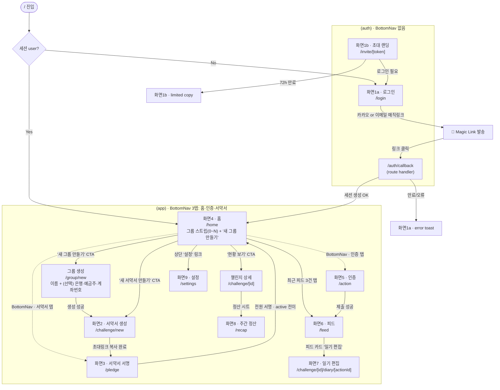
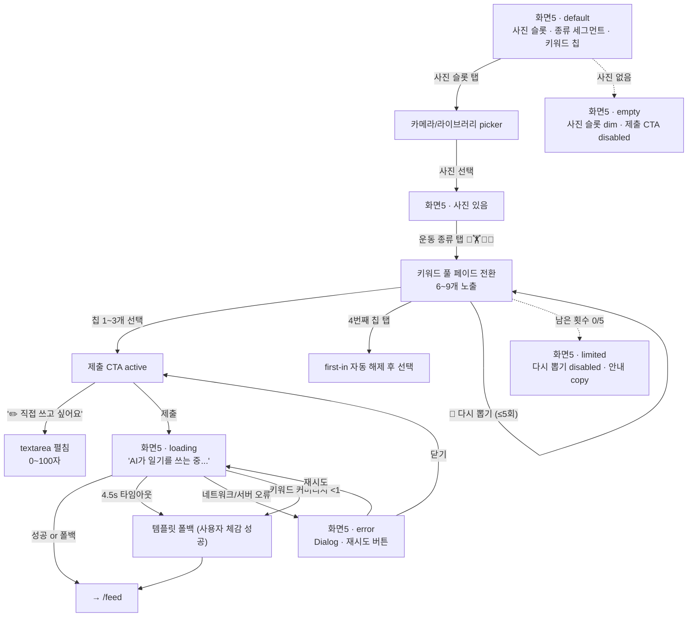
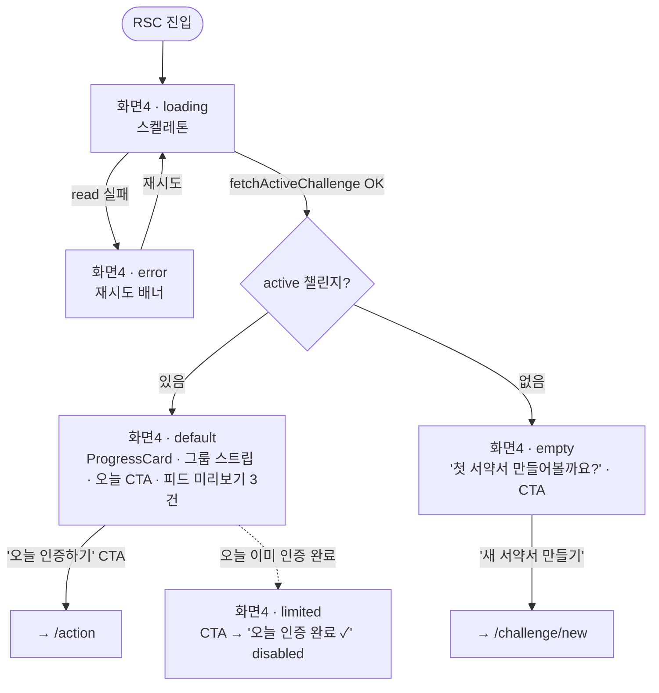
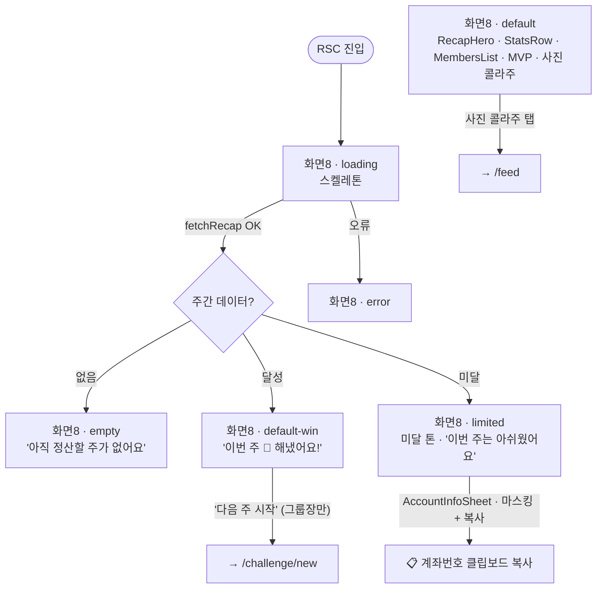
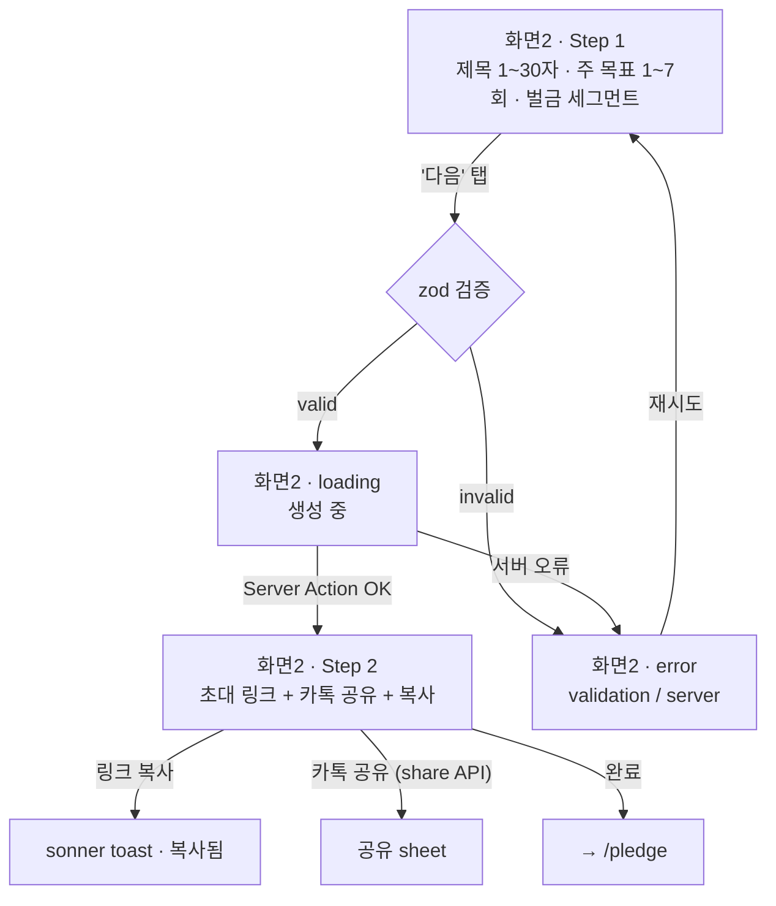
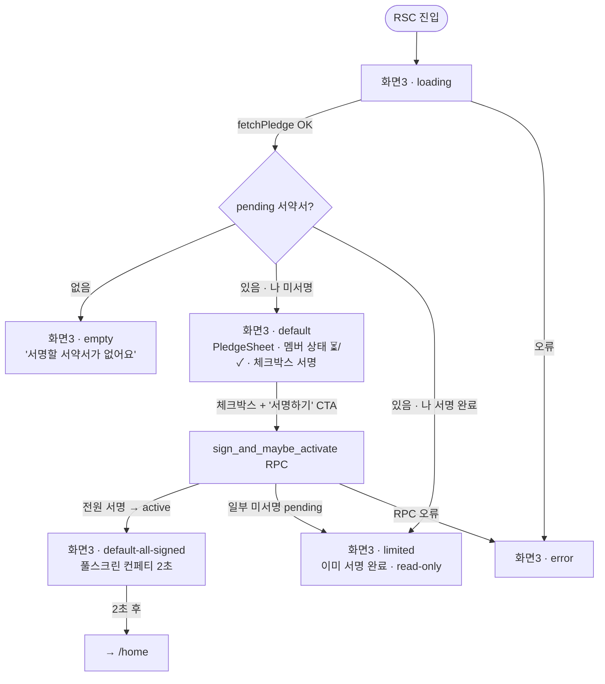
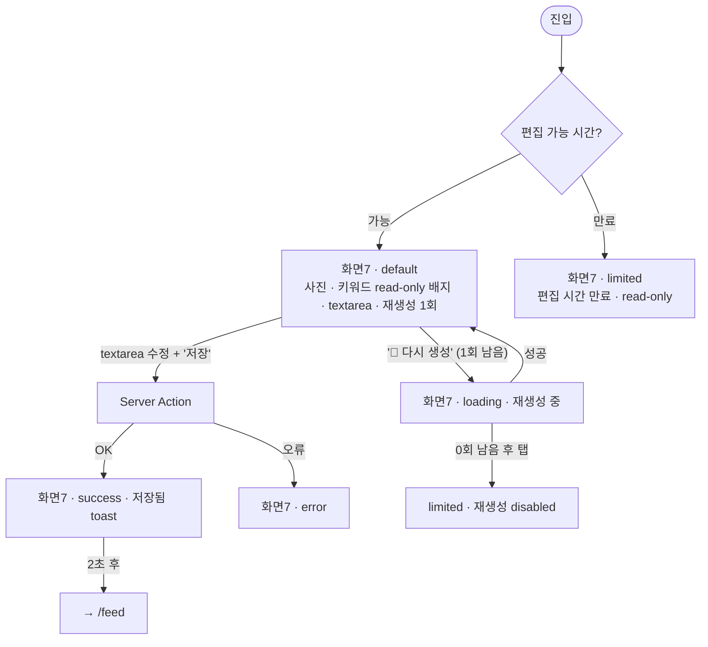
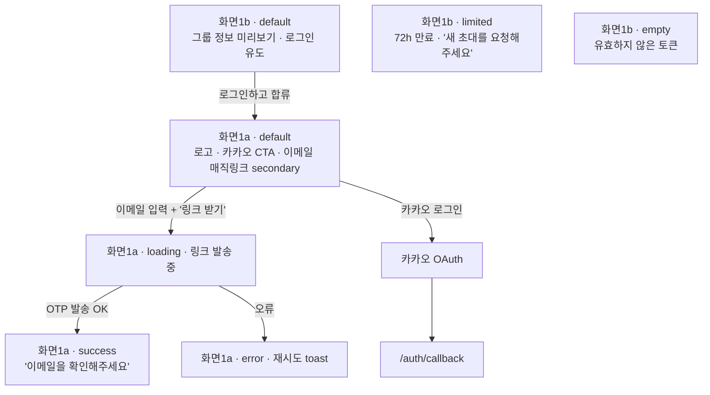
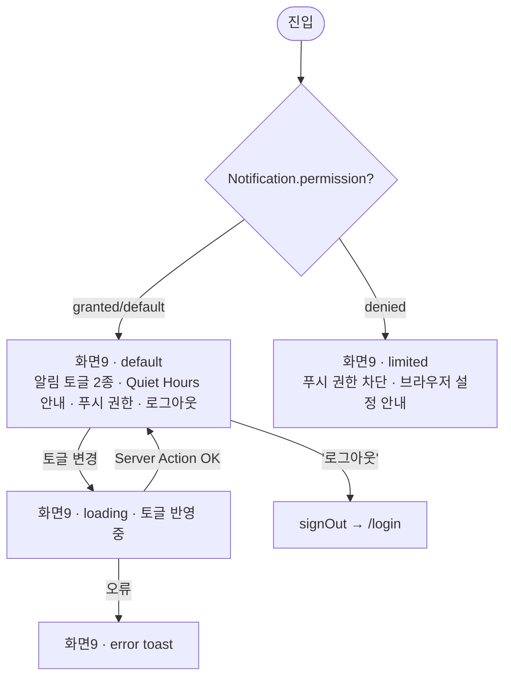
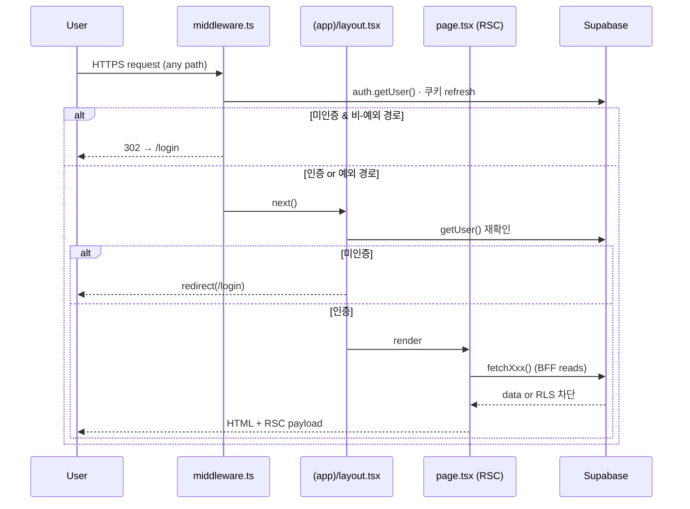

# 🗺 with-key · Design Flow (v1)

> **문서 상태**: v1.0 · **업데이트**: 2026-05-01
> **대상 독자**: Claude Design (Primary) · FE 개발자 · PO
> **Pre-read**: [DESIGN_BRIEF.md](./DESIGN_BRIEF.md) — §0 Output Rules · §2 화면 인벤토리 · §6 화면별 상세
>
> **이 문서의 역할**: Claude Design이 화면 전환·상태 분기를 읽고 바로 디자인할 수 있는 **Mermaid 플로우 팩**. DESIGN_BRIEF §2의 9개 화면 + §7 상태 변이 체크리스트를 다이어그램으로 직렬화한다.
>
> **읽는 규칙**:
> - 노드 ID는 `S{번호}` (DESIGN_BRIEF §2 화면 번호와 1:1)
> - 서브그래프는 라우트 그룹 `(auth)` / `(app)` 분리
> - 엣지 라벨 = **트리거 + 결과** (탭/제출/타임아웃 등)
> - 다이아몬드 = 조건 분기 · 대문자 suffix = 상태 (`L`=loading, `E`=error, `EM`=empty, `LT`=limited)

---

## 1. 전체 네비게이션 (auth → app · BottomNav 3탭)



---

## 2. 화면별 상태 플로우 (default / loading / empty / error / limited)

> DESIGN_BRIEF §7 상태 변이 체크리스트를 각 화면에 매핑. Claude Design이 **동일 파일에 조건부 렌더**로 출력할 상태들.

### 2.1 화면 5 — 인증 `/action` ★ 코어



### 2.2 화면 4 — 홈 `/home`



### 2.3 화면 8 — 주간 정산 `/recap`



### 2.4 화면 2 — 서약서 생성 `/challenge/new`



### 2.5 화면 3 — 서약서 서명 `/pledge`



### 2.6 화면 6 — 피드 `/feed`

```mermaid
flowchart TD
  S6[화면6 · default<br/>인증 카드 리스트 · 사진 풀블리드 · AI 일기 3~5줄]
  S6L[화면6 · loading · 스켈레톤 카드 3개]
  S6EM[화면6 · empty<br/>'첫 인증을 올려볼까요?' · CTA]

  Entry([진입]) --> S6L
  S6L -->|fetchChallengeFeed OK| S6Q{items.length?}
  S6L -->|오류| S6E[화면6 · error]
  S6Q -->|0| S6EM
  S6Q -->|>0| S6

  S6 -- "카드 이모지 탭 🔥💪👏" --> Kudos[Kudos 배지 카운트 +1]
  S6 -- "카드 '일기 편집'" --> goS7[→ /challenge/[id]/diary/[actionId]]
  S6 -. "편집 시간 경과 후" .-> S6LT[화면6 · limited<br/>'일기 편집' disabled]
  S6EM -- "'인증하러 가기'" --> goS5[→ /action]
```

### 2.7 화면 7 — 일기 상세/편집 `/challenge/[id]/diary/[actionId]`

> **라우트 신설 제안** (DESIGN_BRIEF §6.7). 현재 미존재.



### 2.8 화면 1 — 로그인 `/login` · 초대 `/invite/[token]`



### 2.9 화면 9 — 설정 `/settings`



---

## 3. 전역 가드 & 라우팅 시퀀스



---

## 4. 상태 적용 체크리스트 (per screen)

Claude Design이 각 화면 `.tsx` 출력 시 **동일 파일에 조건부로 포함**해야 할 상태:

| 화면 | default | loading | empty | error | limited |
|---|:---:|:---:|:---:|:---:|:---:|
| S5 인증 | ✅ | ✅ AI 쓰는 중 | ✅ 사진 없음 | ✅ Dialog | ✅ 다시 뽑기 0/5 |
| S4 홈 | ✅ | ✅ 스켈레톤 | ✅ 첫 서약서 | ✅ 재시도 | ✅ 오늘 인증 완료 |
| S8 Recap | ✅ 달성/미달 | ✅ | ✅ 주 없음 | ✅ | ✅ 미달 톤 |
| S2 생성 | ✅ 2-step | ✅ 생성 중 | — | ✅ validation | — |
| S3 서명 | ✅ | ✅ | ✅ 서약서 없음 | ✅ | ✅ 이미 서명 |
| S6 피드 | ✅ | ✅ 스켈레톤 | ✅ 첫 인증 | ✅ | ✅ 편집 시간 만료 |
| S7 일기편집 | ✅ | ✅ 재생성 | — | ✅ | ✅ 재생성 0/1, 시간 만료 |
| S1 로그인/초대 | ✅ | ✅ 발송 중 | ✅ 무효 토큰 | ✅ | ✅ 72h 만료 |
| S9 설정 | ✅ | ✅ 토글 반영 | — | ✅ | ✅ 푸시 차단 |

---

## 5. Changelog

- **v1.0** (2026-05-01) — 초판. DESIGN_BRIEF §2 화면 9개 × §7 상태 5종을 Mermaid로 직렬화. Claude Design 첨부용 단일 플로우 팩.
