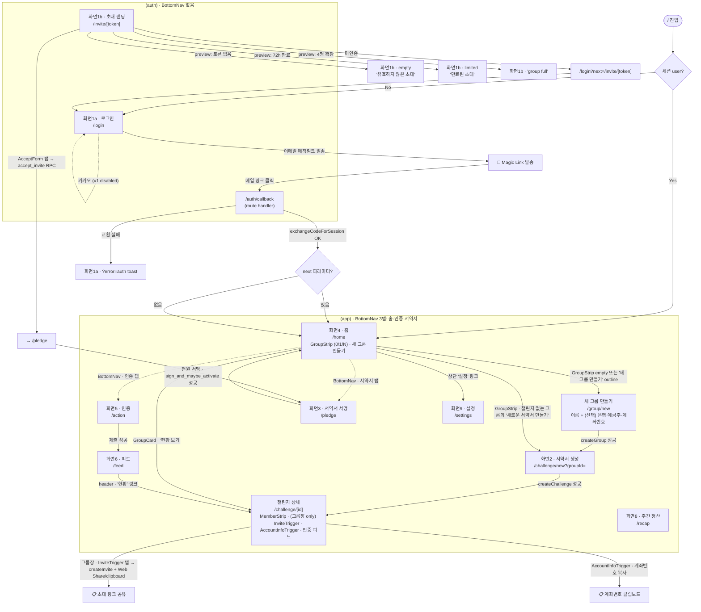
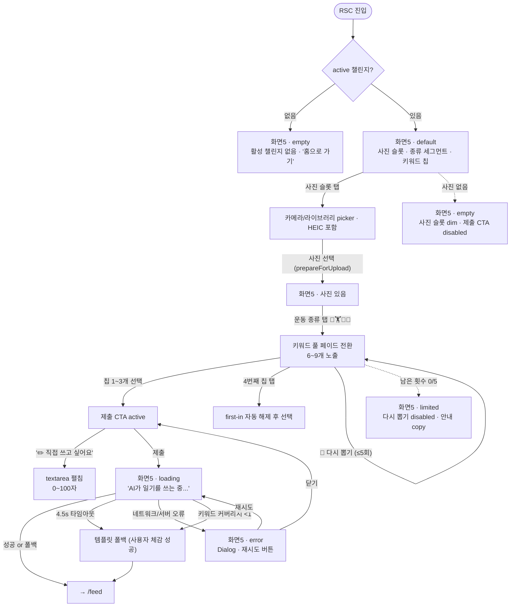
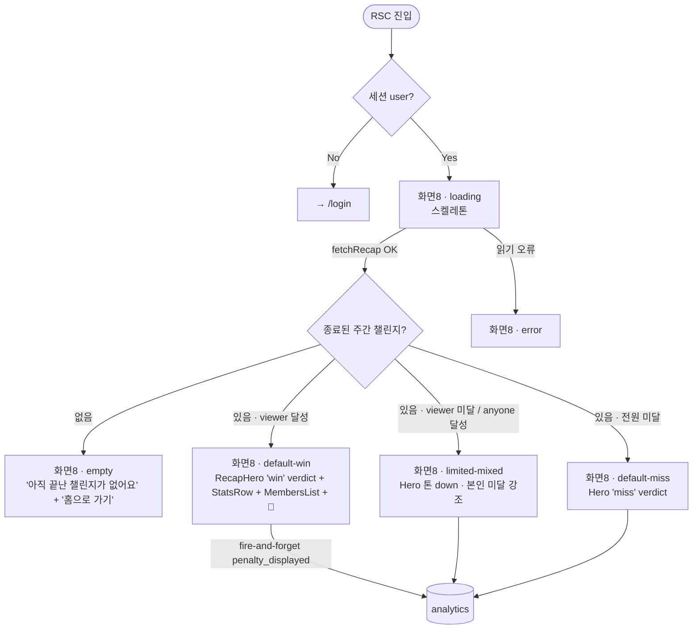
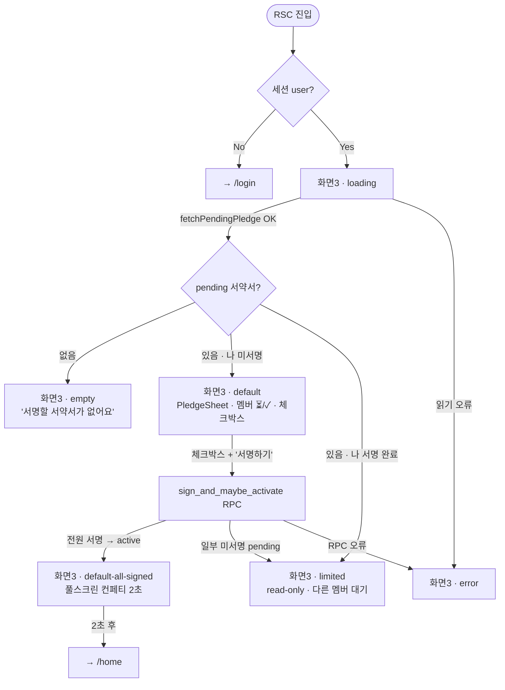
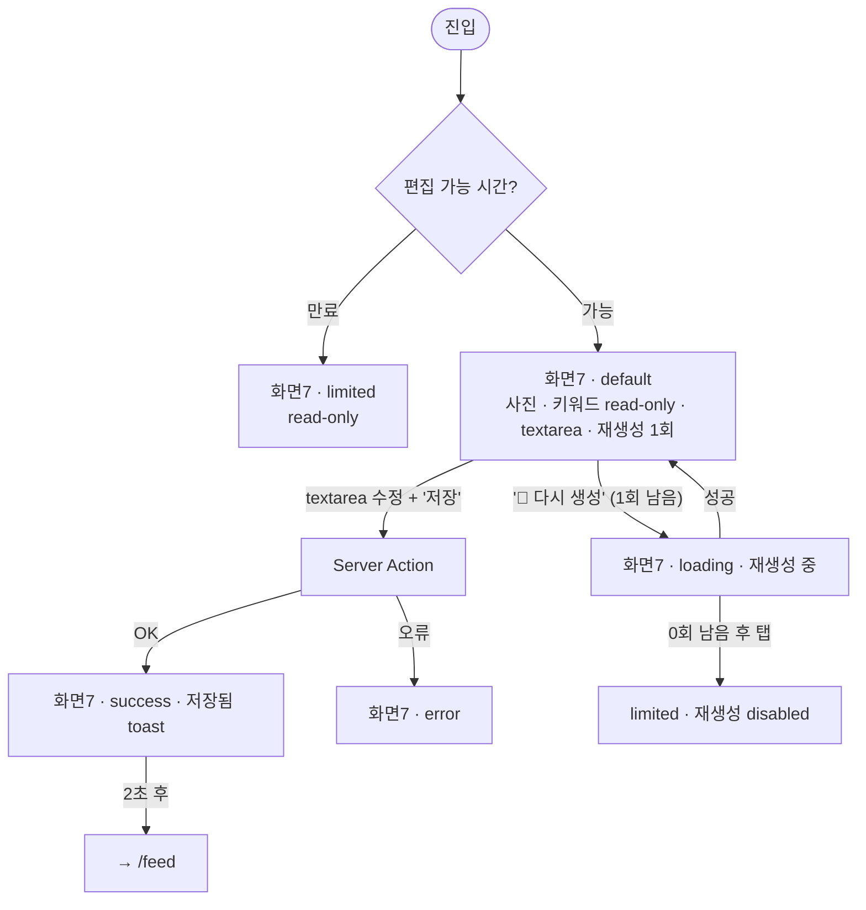
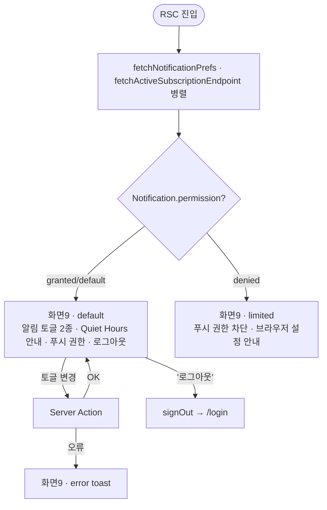
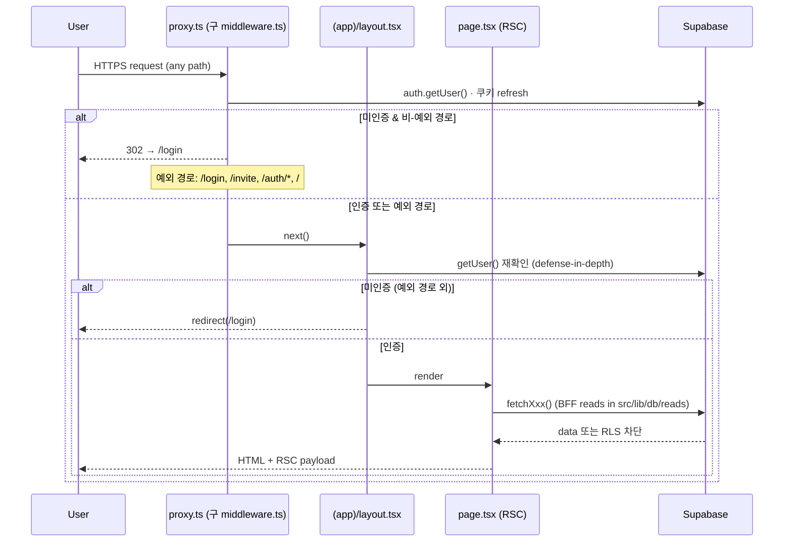

# 🗺 with-key · Design Flow (v1.1)

> **문서 상태**: v1.1 · **업데이트**: 2026-05-06
> **대상 독자**: Claude Design (Primary) · FE 개발자 · PO
> **Pre-read**: [DESIGN_BRIEF.md](./DESIGN_BRIEF.md) — §0 Output Rules · §2 화면 인벤토리 · §6 화면별 상세
>
> **이 문서의 역할**: Claude Design이 화면 전환·상태 분기를 읽고 바로 디자인할 수 있는 **Mermaid 플로우 팩**. DESIGN_BRIEF §2의 9개 화면 + §7 상태 변이 체크리스트를 다이어그램으로 직렬화한다. 코드 머지 후 실제 라우트와 동기화 유지.
>
> **읽는 규칙**:
> - 노드 ID는 `S{번호}` (DESIGN_BRIEF §2 화면 번호와 1:1). 신규 화면은 `SN` (그룹 생성), `ChD` (챌린지 상세) 처럼 의미 prefix.
> - 서브그래프는 라우트 그룹 `(auth)` / `(app)` 분리
> - 엣지 라벨 = **트리거 + 결과** (탭/제출/타임아웃 등)
> - 다이아몬드 = 조건 분기 · 대문자 suffix = 상태 (`L`=loading, `E`=error, `EM`=empty, `LT`=limited)
>
> **자주 쓰는 약어**:
> - **RSC** (React Server Component): Next.js App Router의 서버에서 렌더되는 컴포넌트. 기본값.
> - **RLS** (Row Level Security): Postgres 행 단위 접근 제어. 멤버십 기반 데이터 격리에 사용.
> - **RPC** (Remote Procedure Call): Supabase의 DB 함수 호출. RLS 우회가 필요한 트랜잭션에 `SECURITY DEFINER` 로 사용.
> - **OTP** (One-Time Password): 매직링크 메일이 발송되는 1회용 인증 토큰.
> - **BFF read** (Backend-For-Frontend read): 페이지 컴포넌트(RSC)가 직접 호출하는 서버 사이드 데이터 fetch. `src/lib/db/reads/*` 모듈에 모음.

---

## 1. 전체 네비게이션 (auth → app · BottomNav 3탭)

루트 `/` 진입 시 세션 유무로 분기. (auth) 그룹은 BottomNav 미렌더, (app) 그룹은 `(app)/layout.tsx` 가 강제 인증.



> **노트**: `/challenge/[id]/diary/[actionId]` (일기 편집) 라우트는 DESIGN_BRIEF §6.7 에 명세되어 있으나 **현재 미구현**. §2.7 다이어그램은 신설 시 가이드용으로 유지.

---

## 2. 화면별 상태 플로우 (default / loading / empty / error / limited)

> DESIGN_BRIEF §7 상태 변이 체크리스트를 각 화면에 매핑. Claude Design이 **동일 파일에 조건부 렌더**로 출력할 상태들.

### 2.1 화면 5 — 인증 `/action` ★ 코어

이 화면은 사진 → 운동 종류 → 키워드 → 제출의 4-step 작성 흐름. 키워드 풀(pool)은 운동 종류별로 사전 정의된 후보 단어 목록(예: 헬스용 '데드리프트', 요가용 '코브라'), 매번 6~9개를 무작위 노출.



> **AC 참조**: PRD §5.3 (AI 일기 AC — 4.5초 타임아웃 · 키워드 커버리지 < 1 시 폴백). 폴백이 사용자에게는 성공처럼 보여야 함이 핵심.

### 2.2 화면 4 — 홈 `/home`

내가 속한 그룹별 진행 상황을 한눈에 보여주는 entrypoint. 그룹 0/1/N 에 따라 GroupStrip 레이아웃이 달라진다.

```mermaid
flowchart TD
  Entry([RSC 진입]) --> AuthQ{세션 user?}
  AuthQ -->|No| GoLogin[→ /login]
  AuthQ -->|Yes| FetchL[fetchCurrentChallenges 로딩]
  FetchL --> GroupQ{groups.length}
  GroupQ -->|0| S4EM[화면4 · empty<br/>'아직 속한 그룹이 없어요'<br/>+ '새 그룹 만들기' CTA]
  GroupQ -->|1| S4one[화면4 · 단일 GroupCard<br/>ProgressCard 또는 '서약서 만들기']
  GroupQ -->|>=2| S4many[화면4 · horizontal scroll strip<br/>각 카드 ProgressCard 또는 빈 그룹 카드]

  S4EM -- "'새 그룹 만들기'" --> goSN[→ /group/new]
  S4one -- "ProgressCard '현황 보기'" --> goChD[→ /challenge/[id]]
  S4one -. "챌린지 없는 그룹" .-> goS2g[→ /challenge/new?groupId=]
  S4many -- "카드별 액션" --> goChD
  S4many -- "하단 outline · '새 그룹 만들기'" --> goSN
  S4one -- "하단 outline · '새 그룹 만들기'" --> goSN
  S4one -- "header · '설정'" --> goS9[→ /settings]
```

> **노트**: 홈에는 더 이상 별도 "오늘 인증 CTA"·"피드 미리보기 3건"이 없다. 인증·피드·서약서는 BottomNav 또는 GroupCard 의 '현황 보기' 경유. BottomNav 의 홈 탭은 미읽음 Kudos 가 있을 때 dot 만 표시 (PR #14, presence-only).

### 2.3 화면 8 — 주간 정산 `/recap`

종료된 주간 챌린지의 결과 회고. 예전 v1.0 문서가 이 화면에 표시한다고 적었던 AccountInfoSheet 는 실제로 **챌린지 상세 화면(§2.11)** 에 있음 — 정정.



> **노트**: 현재 구현은 RecapHero · RecapStatsRow · RecapMembersList 3개 컴포넌트만. 사진 콜라주, '다음 주 시작' CTA, AccountInfoSheet 는 **미구현** (DESIGN_BRIEF 와의 갭). 이 갭은 PRD §10 후속 작업.

### 2.4 화면 2 — 서약서 생성 `/challenge/new?groupId=`

groupId 쿼리스트링이 필수. 1-step 단일 form 으로 단순화됨 — 초대 단계는 챌린지 상세 화면(§2.11)의 InviteTrigger 가 담당하므로 분리됐다.

```mermaid
flowchart TD
  Entry([Client 진입]) --> GidQ{groupId query?}
  GidQ -->|없음| S2NoGid[toast '그룹 정보가 없어요']
  GidQ -->|있음| S2[화면2 · default<br/>제목 30자 · 주 목표 1~5회 · 기간 · 벌금]
  S2 -- "'다음: 서약서 쓰기' 탭" --> S2L[화면2 · loading · 생성 중]
  S2L -->|createChallenge OK| goChD[→ /challenge/[id]]
  S2L -->|validation/upstream 오류| S2E[화면2 · error toast]
  S2L -->|unauthorized| GoLogin[→ /login]
  S2E -- "사용자 재시도" --> S2
```

> **AC 참조**: PRD §3.3 AC-1 (서약서 생성 — 제목·주 목표·기간·벌금 4필드). 주 목표는 1~5회 옵션(`GOAL_OPTIONS = [1,2,3,4,5]`).

### 2.5 화면 3 — 서약서 서명 `/pledge`

PledgeSheet 가 멤버 서명 상태를 보여주고, 본인이 미서명이면 체크박스 + CTA 노출. 전원 서명 시 챌린지가 active 로 전이된다.



> **AC 참조**: PRD §3.3 AC-3 (전원 서명 시 active 전이). RPC `sign_and_maybe_activate` 는 마지막 서명자에 한해 챌린지 status 를 active 로 전이시킨다.

### 2.6 화면 6 — 피드 `/feed`

최근 인증 카드 리스트. PR #14 부터 미읽음 Kudos 배지가 헤더에 표시된다. 진행 중 챌린지가 없으면 empty.

```mermaid
flowchart TD
  Entry([RSC 진입]) --> AuthQ{세션 user?}
  AuthQ -->|No| GoLogin[→ /login]
  AuthQ -->|Yes| Order[fetchUnreadKudosCount 먼저 → markFeedSeen 후]
  Order --> ActiveQ{active 챌린지?}
  ActiveQ -->|없음| S6EM[화면6 · empty<br/>'현재 진행 중인 챌린지가 없어요' + '홈으로 가기']
  ActiveQ -->|있음| S6L[fetchChallengeFeed 로딩]
  S6L -->|OK · items.length 0| S6EM2[피드 비어있음 placeholder]
  S6L -->|OK · items > 0| S6[화면6 · default<br/>UnreadBadge · '현황' 링크 · ChallengeFeed 카드 리스트]
  S6L -->|읽기 오류| S6E[화면6 · error]

  S6 -- "카드 이모지 탭 🔥💪👏" --> Kudos[Kudos 배지 카운트 +1]
  S6 -- "header · '현황'" --> goChD[→ /challenge/[id]]
  S6 -. "(미구현) 일기 편집" .-> goS7[→ /challenge/[id]/diary/[actionId]]
```

> **노트**: 카운트 → seen 마킹 순서 중요. 역순이면 배지가 절대 안 뜬다. 일기 편집 라우트는 §2.7 신설 제안 상태.

### 2.7 화면 7 — 일기 상세/편집 `/challenge/[id]/diary/[actionId]` (미구현)

> **현재 미구현**. DESIGN_BRIEF §6.7 에 명세되어 있으나 라우트 파일 자체가 없음. 신설 시 아래 다이어그램 사용.



### 2.8 화면 1 — 로그인 `/login` · 초대 `/invite/[token]`

로그인은 이메일 매직링크 (카카오는 v1 disabled). 초대 페이지는 미인증 시 로그인으로 보내고, 인증되면 preview 분기 후 AcceptForm.

```mermaid
flowchart TD
  S1a[화면1a · default<br/>로고 · '카카오로 시작하기 (v1)' disabled · 이메일 매직링크]
  S1aL[화면1a · loading · 링크 발송 중]
  S1aW[화면1a · success<br/>'이메일을 확인해주세요']
  S1aRL[화면1a · rate_limited<br/>'요청이 너무 많아요' toast]
  S1aE[화면1a · error<br/>'잠시 후 다시 시도' toast]

  S1a -- "이메일 입력 + '링크 받기'" --> S1aL
  S1aL -->|requestMagicLink OK| S1aW
  S1aL -->|429 / over_*_rate_limit| S1aRL
  S1aL -->|기타 upstream_error| S1aE
  S1aW -. "사용자 메일 클릭" .-> CB["/auth/callback?code=&next="]
  CB -->|exchange OK| goNext[→ next || /home]
  CB -->|exchange 실패| S1aE2["/login?error=auth"]

  S1b[화면1b · 진입] --> S1bAuth{세션 user?}
  S1bAuth -->|No| S1bRedirect["/login?next=/invite/[token]"]
  S1bRedirect --> S1a
  S1bAuth -->|Yes| S1bPrev[fetchInvitePreview 로딩]
  S1bPrev -->|토큰 없음| S1bEM[화면1b · empty<br/>'유효하지 않은 초대']
  S1bPrev -->|expires_at 지남| S1bLT[화면1b · limited<br/>'만료된 초대 · 새 링크 요청']
  S1bPrev -->|members >= 4| S1bF[화면1b · '그룹이 가득 찼어요']
  S1bPrev -->|OK| S1bDef[화면1b · default<br/>그룹명 + (있으면) PledgeSummary + AcceptForm]

  S1bDef -- "AcceptForm 탭 → accept_invite RPC" --> S1bSucc{RPC 결과}
  S1bSucc -->|OK| goPledge[→ /pledge]
  S1bSucc -->|forbidden / not_found / invalid_input| S1bToast[error toast · same screen]
```

> **노트**: 매직링크 발송 후 사용자가 메일에서 링크를 클릭해야 callback 으로 돌아옴 — 같은 브라우저 세션이 아닐 수 있다. Supabase 의 OTP 매직링크는 이메일당 60초 쿨다운 + 시간당 쿼터가 있어 `rate_limited` 와 `upstream_error` 를 분리한다 (PR #16).
>
> **알려진 갭**: 현재 `requestMagicLink` 의 `emailRedirectTo` 에 `next` 파라미터가 포함되지 않아, /invite 진입 → 로그인 후 /home 로 이동하고 초대 페이지로 자동 복귀하지 않는다 (사용자가 메일 또는 초대 메시지를 다시 열어야 함). 향후 보강 후보.

### 2.9 화면 9 — 설정 `/settings`

푸시 알림 토글 + 권한 상태.



### 2.10 (NEW) 새 그룹 만들기 `/group/new`

이름 필수 + 은행·예금주·계좌번호 묶음 optional. 계좌 3필드는 all-or-nothing (3개 다 입력 또는 3개 다 비움). 계좌번호는 서버에서 AES-256-GCM 으로 암호화되어 DB 에 저장 (D-016).

```mermaid
flowchart TD
  SN[화면 · default<br/>그룹 이름 input + 'details' 토글<br/>(은행 select · 예금주 · 계좌번호)]
  SN -- "submit" --> SNV{필드 검사}
  SNV -->|이름 비어있음| SNToast1[toast '그룹 이름을 입력해 주세요']
  SNV -->|계좌 3필드 1~2개만 채움| SNToast2[toast '모두 입력하거나 전부 비워주세요']
  SNV -->|이름만 채움| SNL[화면 · loading · 생성 중]
  SNV -->|이름 + 계좌 3필드| SNL
  SNL -->|createGroup OK| goS2[→ /challenge/new?groupId=]
  SNL -->|validation 실패| SNE[화면 · error toast · 첫 issue 표시]
  SNL -->|unauthorized| GoLogin[→ /login]
  SNL -->|upstream_error| SNFallback[fallback toast]
```

> **노트**: 계좌번호 평문은 클라이언트 → Server Action 으로만 흐르고, DB 에는 암호문(`account_number_encrypted` bytea) + 마지막 4자리(`account_number_last4`) 만 저장. 멤버에게는 마스킹된 형태로 노출되며 평문은 챌린지 상세의 AccountInfoTrigger 복사 시점에만 서버에서 복호화되어 클립보드로 들어간다.

### 2.11 (NEW) 챌린지 상세 `/challenge/[id]`

홈 GroupCard '현황 보기' 또는 피드 헤더 '현황' 에서 진입. 그룹장에게만 InviteTrigger 가 추가로 표시된다.

```mermaid
flowchart TD
  Entry([RSC 진입]) --> AuthQ{세션 user?}
  AuthQ -->|No| GoLogin[→ /login]
  AuthQ -->|Yes| ChDL[fetchChallengeDetail · fetchChallengeFeed]
  ChDL -->|상세 없음| Ch404[notFound]
  ChDL -->|OK| ChD[화면 · default<br/>헤더 · MemberStrip · (그룹장 only) InviteTrigger · settlement+AccountInfoTrigger · ChallengeFeed]

  ChD -- "InviteTrigger 탭 (그룹장)" --> Inv[createInvite Server Action]
  Inv -->|OK · navigator.share 가능| Share[Web Share Sheet]
  Inv -->|OK · share 미지원| Copy[clipboard 복사 + toast]
  Inv -->|forbidden| InvToast[toast '그룹장만 만들 수 있어요']

  ChD -- "AccountInfoTrigger 탭" --> AS[AccountInfoSheet · 마스킹된 last4 표시]
  AS -- "'계좌번호 복사' 탭" --> Reveal[revealAccountNumber Server Action]
  Reveal -->|OK| ASCopy[복호화된 평문 → clipboard]
  Reveal -->|복호화 실패| ASE[upstream_error toast]
  AS -. "계좌 미등록 그룹" .-> ASNone[안내문 + 복사 disabled]

  ChD -- "ChallengeFeed 카드 이모지 탭" --> Kudos[Kudos +1 · upsert]
```

> **AccountInfoSheet 보안 노트**: revealAccountNumber 서버 액션은 RLS 경로(`groups_select_member`)로만 암호문을 SELECT 하므로, 비멤버는 평문은커녕 암호문도 받을 수 없다. 복호화 실패는 평문/암호문이 로그에 남지 않도록 `upstream_error` 로 정규화 (D-020).

---

## 3. 전역 가드 & 라우팅 시퀀스

Next.js 16 부터 `middleware.ts` 컨벤션이 `proxy.ts` 로 변경됨 (PR #18 codemod). 함수명도 `proxy` 로 변경, 동작은 동일.



> **인증 우회 경로**: `/login`, `/invite/*`, `/auth/*`, `/`. 그 외는 모두 미인증 시 `/login` 리다이렉트.

---

## 4. 상태 적용 체크리스트 (per screen)

Claude Design이 각 화면 `.tsx` 출력 시 **동일 파일에 조건부로 포함**해야 할 상태:

| 화면 | default | loading | empty | error | limited |
|---|:---:|:---:|:---:|:---:|:---:|
| S5 인증 | ✅ | ✅ AI 쓰는 중 | ✅ 사진 없음 / active 챌린지 없음 | ✅ Dialog | ✅ 다시 뽑기 0/5 |
| S4 홈 | ✅ groups>0 | ✅ 스켈레톤 | ✅ 그룹 0건 (GroupStrip 내부) | — (empty 가 안전한 fallback) | — |
| S8 Recap | ✅ win/miss/mixed | ✅ | ✅ 끝난 챌린지 없음 | ✅ | (mixed 가 limited 역할) |
| S2 생성 | ✅ single form | ✅ 생성 중 | — | ✅ validation / upstream | — |
| S3 서명 | ✅ | ✅ | ✅ 서약서 없음 | ✅ RPC 오류 | ✅ 이미 서명 |
| S6 피드 | ✅ | ✅ 스켈레톤 | ✅ active 없음 / items 0 | ✅ | (일기 편집 미구현) |
| S7 일기편집 | (미구현) | (미구현) | — | (미구현) | (미구현) |
| S1a 로그인 | ✅ | ✅ 발송 중 | — | ✅ upstream_error | ✅ rate_limited |
| S1b 초대 | ✅ preview OK | ✅ | ✅ 무효 토큰 | ✅ accept RPC 오류 | ✅ 72h 만료 / 4명 꽉참 |
| S9 설정 | ✅ | ✅ 토글 반영 | — | ✅ | ✅ 푸시 차단 |
| SN 그룹 생성 | ✅ | ✅ 생성 중 | — | ✅ validation toast | — |
| ChD 챌린지 상세 | ✅ | (RSC suspense) | ✅ notFound | (read 오류 시 RSC 에러 바운더리) | ✅ 계좌 미등록 그룹 |

---

## 5. 용어집

본문에서 처음 등장한 약어·도메인 용어 모음. 가나다 순.

- **AccountInfoSheet** — 챌린지 상세에서 그룹 계좌 정보를 보여주고 평문 계좌번호를 복사할 수 있는 시트 컴포넌트.
- **AcceptForm** — 초대 토큰 페이지에서 "참여하기" 버튼을 눌러 `accept_invite` RPC를 호출하는 클라이언트 컴포넌트.
- **active 챌린지** — 모든 멤버가 서명을 마쳐 status 가 `active` 로 전이된 진행 중인 챌린지. 인증·피드·정산이 가능한 단계.
- **BFF read** (Backend-For-Frontend read) — RSC 가 직접 호출하는 서버 사이드 데이터 fetch. `src/lib/db/reads/*` 모듈에 모음.
- **GroupStrip** — 홈 화면에서 내가 속한 그룹들을 0/1/N 케이스에 따라 다른 레이아웃으로 보여주는 컴포넌트.
- **InviteTrigger** — 그룹장 전용 버튼. 초대 토큰을 만들고 Web Share API 또는 클립보드로 복사한다.
- **OTP** (One-Time Password) — Supabase 매직링크 메일에 들어가는 1회용 인증 토큰.
- **pending 챌린지** — 생성됐지만 아직 전원이 서명하지 않아 status 가 `pending` 인 챌린지. 서명만 가능, 인증은 불가.
- **PledgeSheet** — 서약서 서명 화면의 핵심 컴포넌트. 멤버별 서명 상태와 본인 서명 체크박스.
- **ProgressCard** — 그룹별 챌린지 진행 상황 카드 (목표 횟수 / 누적 벌금 풀 / 남은 일수).
- **RLS** (Row Level Security) — Postgres 행 단위 접근 제어. 멤버십 기반 데이터 격리.
- **RPC** (Remote Procedure Call) — Supabase DB 함수 호출. RLS 우회가 필요한 트랜잭션은 `SECURITY DEFINER` 로 실행.
- **RSC** (React Server Component) — Next.js App Router 의 기본 서버 렌더 컴포넌트.
- **Quiet Hours** — 야간 시간대 (예: 22:00~07:00) 푸시 알림을 보내지 않는 정책. 설정 화면에서 안내.
- **viewer 달성** — 정산 대상 주간에서 본인 인증이 목표 횟수 이상인 상태.

---

## 6. Changelog

- **v1.1** (2026-05-06) — multi-group + 계좌 정산 (#17), 친구 초대·수락 플로우 (#19), middleware→proxy codemod (#18) 반영. 주요 정정: AccountInfoSheet 위치 (recap → /challenge/[id]), challenge/new 1-step 단순화, /group/new · /challenge/[id] 다이어그램 신설, /invite/[token] preview/accept 분리, BottomNav unread dot, login rate_limited 분기, 약어 풀어쓰기 + 용어집.
- **v1.0** (2026-05-01) — 초판. DESIGN_BRIEF §2 화면 9개 × §7 상태 5종을 Mermaid로 직렬화. Claude Design 첨부용 단일 플로우 팩.
