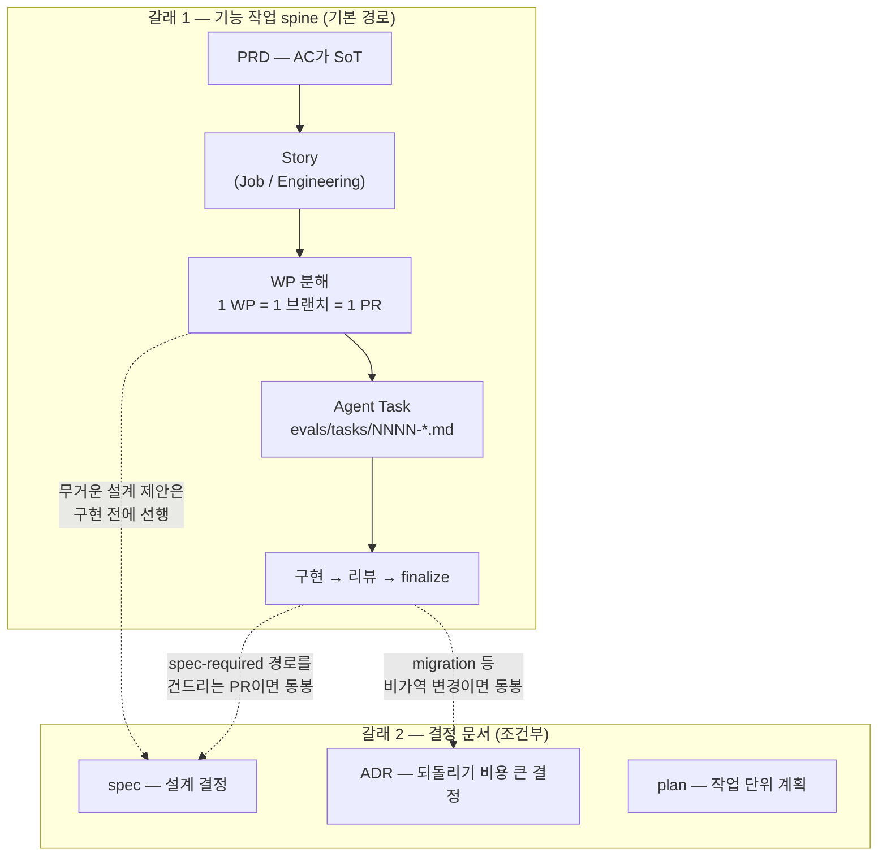

# 작업·문서 흐름 — PRD에서 코드까지

PRD를 쓰고 나면 무엇을 어떤 순서로 만드는지, spec/ADR은 언제 끼어드는지를 한 장으로 정리한 가이드입니다. 가장 흔한 혼동 — **"spec은 모든 작업마다 만드는 단계가 아니다"** — 를 푸는 것이 목적입니다.

> 약어: **PRD**(Product Requirements Document, 제품 요구사항 문서) · **AC**(Acceptance Criteria, 인수 기준) · **WP**(Work Package, 1 브랜치 = 1 PR 단위 작업 묶음) · **ADR**(Architecture Decision Record, 되돌리기 비용 큰 결정 기록). 나머지는 맨 아래 [용어집](#용어집) 참조.

---

## 1. 한눈 그림

작업은 두 갈래로 나뉩니다. **갈래 1(기능 spine)** 이 기본 경로이고, **갈래 2(결정 문서)** 는 조건을 만족할 때만 끼어듭니다.

핵심: **갈래 1은 spec 없이 완주하는 게 정상**입니다. EVAL-0017(RN read-only screens)이 그 예 — task 파일만으로 구현→리뷰→머지까지 갔습니다.

---

## 2. 갈래 1 — 기능 작업 spine

새 기능·화면·포팅 작업이 따라가는 기본 경로입니다. 각 단계의 산출물과 위치:

| 단계       | 산출물 위치                                                                                              | 만드는 방법                                                                      |
| ---------- | -------------------------------------------------------------------------------------------------------- | -------------------------------------------------------------------------------- |
| PRD        | [`docs/PRD.md`](./PRD.md) (web) · [`docs/migration/01-rn-mvp-prd.md`](./migration/01-rn-mvp-prd.md) (RN) | 사람(PO). AC가 모든 하위 산출물의 SoT                                            |
| Story      | [`docs/stories/`](./stories/) (Job Story) · [`docs/eng-stories/`](./eng-stories/) (Engineering Story)    | `.agents/workflows/create-job-stories.md` 등 워크플로                            |
| WP 분해    | eng-story 내 WP 목록                                                                                     | `.agents/workflows/split-work-packages.md` — 1 WP = 1 worktree = 1 브랜치 = 1 PR |
| Agent Task | [`evals/tasks/`](../evals/tasks/) `NNNN-*.md` (append-only)                                              | harness-engineer 에이전트 · `pnpm harness:check`로 형식 검증                     |
| 실행       | 코드 + [`evals/results/agent-results.json`](../evals/results/agent-results.json) runs[]                  | `pnpm harness:goal <ID>` 렌더 → 구현 → 리뷰 → `pnpm harness:finalize <ID>`       |

단계별 세부 절차(워크플로 9개·격리·eval 게이트)는 [`docs/migration/README.md`](./migration/README.md) §4가 SoT입니다 — 이 문서는 "언제 무엇을 만드나"만 다룹니다.

---

## 3. 갈래 2 — 결정 문서 (plan / spec / ADR)

결정 문서는 **작업 단위가 아니라 결정 단위**입니다. 매 작업마다 만들지 않고, 아래 트리거에 걸릴 때만 만듭니다. **왜**: 문서는 보존할 결정이 있을 때만 가치가 있고, 형식적 문서는 읽히지 않은 채 드리프트합니다.

| 문서 | 용도                                                 | 생성 명령               | 위치                      |
| ---- | ---------------------------------------------------- | ----------------------- | ------------------------- |
| plan | 작업 단위 실행 계획 (멀티스텝 작업의 순서·검증 정리) | `pnpm new plan <topic>` | `docs/superpowers/plans/` |
| spec | 설계 결정 (기능 진화 따라 자주 바뀌는 영역)          | `pnpm new spec <topic>` | `docs/superpowers/specs/` |
| ADR  | 되돌리기 비용 큰 결정 (migration·인증 백본 등)       | `pnpm new adr <topic>`  | `docs/adr/`               |

만드는 트리거는 두 가지뿐:

1. **spec-required 경로를 건드리는 PR** — migration · `src/lib/supabase` · `middleware.ts` · 키워드 풀 · validators · analytics · AI 프롬프트의 7개 경로. 같은 PR에 spec 또는 ADR을 동봉합니다. 경로별 권장 산출물 표는 [`AGENTS.md §4`](../AGENTS.md)가 SoT.
2. **구현 전에 사람 승인이 필요한 무거운 설계 제안** — 하네스 머시너리(`.agents/**` · `scripts/harness-*`) 변경처럼 권한 경계상 "제안+사람" 영역([D6](./migration/05-rn-harness-decisions.md))은 spec이 곧 제안서입니다. 승인(머지) 후에 구현 PR이 따라옵니다.

spec과 ADR의 구분 기준은 [`docs/adr/README.md`](./adr/README.md) · [`docs/superpowers/specs/README.md`](./superpowers/specs/README.md) 참조 — 요약하면 "되돌리기 비용이 크면 ADR, 자주 진화하면 spec"입니다.

---

## 4. 빠른 판별 — 지금 내 작업엔 뭐가 필요한가

| 상황                                            | 만들 것                        | 실제 예                                                                                                    |
| ----------------------------------------------- | ------------------------------ | ---------------------------------------------------------------------------------------------------------- |
| 새 기능/화면 (7개 경로 안 닿음)                 | 없음 — spine 따라 Agent Task로 | EVAL-0017: task 파일만으로 머지 완주                                                                       |
| migration·validators·analytics 등 7개 경로 변경 | 같은 PR에 ADR 또는 spec 동봉   | meal 키워드 추가 → [ADR-0015](./adr/0015-meal-activity-type.md)                                            |
| 설계 판단이 무거운 변경을 구현 전에 제안        | spec 선행 → 승인 후 구현 PR    | false-flag 임계 θ → [spec 2026-06-05](./superpowers/specs/2026-06-05-false-flag-threshold-theta.md)        |
| 하네스 머시너리 변경 제안                       | spec 선행 (D6 "제안+사람")     | 오케스트레이션 Phase 2 → [spec 2026-06-12](./superpowers/specs/2026-06-12-harness-orchestration-phase2.md) |
| 멀티스텝 작업의 실행 계획만 정리                | plan                           | —                                                                                                          |

판별이 애매하면: **"이 결정을 6개월 뒤 누가 '왜 이렇게 했지?'라고 물을까?"** — 물을 것 같으면 spec/ADR, 아니면 spine만으로 충분합니다.

---

## 용어집

- **Agent Task**: 에이전트가 1패스로 실행 가능한 최소 작업 단위 — `evals/tasks/NNNN-*.md`, append-only
- **finalize**: task 완료 처리 명령(`pnpm harness:finalize`) — Status done 전환 + runs[] 기록
- **spine**: PRD → Story → WP → Agent Task로 내려가는 분해 파이프라인
- **SoT**(Source of Truth): 중복 정의 없이 기준으로 삼는 단일 원본
- **spec-required 경로**: 변경 시 spec/ADR 동봉이 필요한 7개 경로 ([`AGENTS.md §4`](../AGENTS.md))
- **D6**: 하네스 권한 경계 결정([05-rn-harness-decisions](./migration/05-rn-harness-decisions.md)) — 자율 / 제안+사람 / 절대 금지 3단
