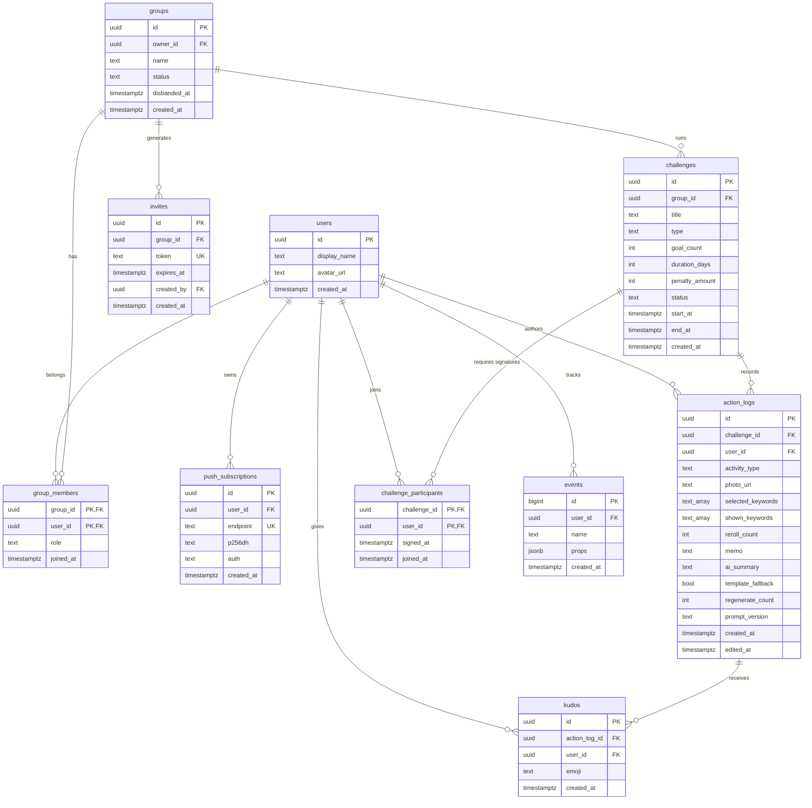
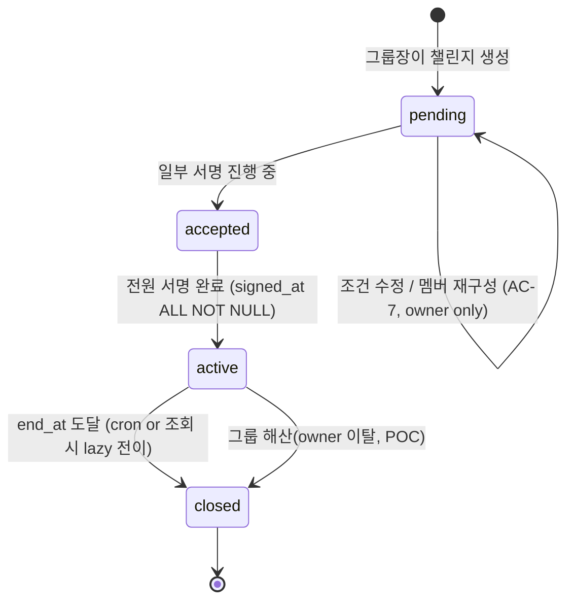

# docs/junior/BE_SCHEMA.md — Backend Schema Design (주니어판)

> **원본**: [`../BE_SCHEMA.md`](../BE_SCHEMA.md). 두 문서가 어긋나면 원본이 기준.

- **문서 상태**: Draft v0.3 · **작성자**: Ian · **작성일**: 2026-04-28
- **대상 독자**: BE 담당 (쟁뜌) · FE (Server Action 계약 확인) · PO · QA (상태 전이 검증)
- **Pre-read**:
  - [`PRD.md`](./PRD.md) §3~§9 — 기능·AC·데이터 모델 초안·이벤트 스키마
  - [`ONBOARDING.md`](./ONBOARDING.md) §4.3, §5.4, §6.1, §6.5 — 마이그레이션 원칙·타입 정책·Supabase/RLS·이벤트 로깅
  - [`DECISIONS.md`](./DECISIONS.md) D-005 · D-006 · D-007 — 서약서 명칭/기간/금액

## 이 문서는 무엇인가

`with-key`의 **백엔드 스키마(테이블·컬럼·제약·인덱스·RLS 정책·상태 전이)를 Day 1에 바로 마이그레이션으로 투입 가능한 수준까지 구체화한** 단일 출처(SoT) 문서입니다. PRD §8의 초안을 구현 가능한 형태로 확정한 버전입니다.

### 이 문서가 아닌 것

- **완성된 DDL 원본 파일이 아닙니다.** 본 문서 확정 후 `supabase/migrations/0001_init.sql` · `0002_rls.sql`에 반영합니다.
- v1 이후 확장(결제·알림톡·멀티 챌린지 타입)은 다루지 않습니다.

---

## 0. 설계 원칙

1. **PRD §8을 기반으로 최신 결정(D-005/006/007)을 흡수**하여 업데이트합니다.
2. **zod 스키마(`src/lib/validators/*`) = 입력 레이어의 SoT(Source of Truth, 단일 출처)**, Postgres 제약 = 저장 레이어의 SoT. 두 레이어에서 **중복 방어** (ONBOARDING §5.4).
3. **RLS(Row Level Security, 행 단위 접근 제어) 전 테이블 ON** — 그룹 멤버십(`group_members`) 기준으로 read/write 분리. 예외 없음 (ONBOARDING §6.1).
4. **삭제 금지 원칙** — 인증 로그는 수정·삭제 불가 (PRD §4.3 AC-6). 논리 삭제 컬럼(`deleted_at`)도 POC에서 도입하지 않습니다.
5. **서버 타임 기준** — `created_at`/상태 전이 시각은 전부 `now()` 서버 값 (PRD §4.3 AC-5).
6. **단방향 마이그레이션** — `down` 스크립트 없음 (ONBOARDING §4.3).

---

## 1. 최신 의사결정 반영 요약

| 결정 | 이전 초안 (PRD §8) | 본 문서 반영 | 영향 컬럼/제약 |
|---|---|---|---|
| **D-005** "각서 → 서약서" | 내부 식별자는 영문 `challenge`/`pledge` 유지 | 동일 — DB 식별자 영향 없음. UI 카피 이슈라 본 문서는 식별자 유지. | — |
| **D-006** 서약서 최대 기간 3개월 | `duration_days: 7` 고정 | `duration_days: 1~90` 허용 (7 default) | `challenges.duration_days CHECK (1..90)` |
| **D-007** 최대 금액 10,000원 | `penalty_amount 1,000~20,000` | `penalty_amount 1,000~10,000` | `challenges.penalty_amount CHECK (1000..10000 & %1000=0)` |

> ⚠️ **현 `src/lib/validators/challenge.ts`는 구버전**(`durationDays: literal(7)` · `penaltyAmount max 20000`)을 반영 중입니다. 본 문서 확정과 동시에 validator를 업데이트하고, 두 레이어 제약을 D-006/D-007 기준으로 일치시킵니다.
>
> ⚠️ **PRD §3.3 AC-1 미업데이트**: PRD는 "기간 POC 고정: 1주"로 기록되어 D-006과 충돌합니다. `goal_count`(주 N회)의 **측정 단위가 3개월 챌린지에서 어떻게 적용되는지** 미정의입니다 (매주 독립 평가? 누적?). 본 문서는 DB 제약만 D-006에 맞추고, **주간 반복 평가 로직은 PRD 업데이트 전까지 FE에서 `duration_days=7`로 가드**합니다. PRD 업데이트는 §11 Follow-up으로 이관.

---

## 2. 테이블 인벤토리 (10개)

| # | 테이블 | 목적 | PRD 근거 |
|---|---|---|---|
| 1 | `users` | 표시명·아바타 (auth.users 확장) | §8.2 |
| 2 | `groups` | 단톡방에서 들어온 친구 그룹 (3~4명) + 해산 상태 | §3, §3.4 Edge |
| 3 | `group_members` | 유저↔그룹 N:M + role(owner/member) | §3.3 AC-4 |
| 4 | `invites` | 초대 토큰 · 72h 만료 | §3.3 AC-2 |
| 5 | `challenges` | 서약서 본문(제목·횟수·기간·금액) + 상태 | §3, §8.2 |
| 6 | `challenge_participants` | 서명/참여 여부, `signed_at` | §3.3 AC-3/5 |
| 7 | `action_logs` | 사진+종류+키워드칩 인증 **+ AI 일기 결과 흡수** | §4, §5, §8.2 |
| 8 | `kudos` | 3고정 이모지 응원 (토글) | §7, §8.2 |
| 9 | `push_subscriptions` | Web Push 구독 토큰 | §6 |
| 10 | `events` | 분석 이벤트 로그 (§9) · AI 비용 추적 포함 | §9 |

**신규 추가**: `invites` · `events` (PRD §8.1 명시 9종 외 운영 필수).

**제외 (POC out of scope)**:

- `ai_cost_log` — 규모 불필요. `events(name='ai_generated')` 집계로 대체 → §13 v1 백로그.
- `feed_items` — `action_logs`와 사실상 1:1이라 POC에서는 AI 결과 컬럼을 `action_logs`로 흡수 → §13 v1 백로그 (분리 조건 명시).

---

## 3. ER 다이어그램

ER(Entity-Relationship, 개체-관계) 다이어그램은 테이블 간 관계를 시각화한 것입니다. `||--o{` 표기는 "1개가 여러 개에 대응"(1:N)을 의미합니다.



---

## 4. 상태 머신 — `challenges.status`

상태 머신(state machine)은 "어떤 상태에서 어떤 조건으로 다른 상태로 이동하는지"를 정의한 도식입니다. 각 전이의 **조건과 부수효과**를 여기서 못 박으면 Server Action·RLS 정책·FE 표시를 일관되게 유지할 수 있습니다.



- `pending → accepted`: 서명 1건이라도 존재하면 전이 (UI 피드백용 구분).
- `accepted → active`: 전원 서명 + 서버에서 `start_at = now()`, `end_at = start_at + duration_days` 계산.
- **서명 거부 시** (PRD §3.4 Edge): 상태 전이 없이 `pending` 유지. 그룹장이 해당 멤버를 `challenge_participants`에서 제외 후 재시도 (`pending → pending`).
- `active` 이후 멤버 freeze(AC-6). 조건·기간·금액 수정 불가.

---

## 5. 컬럼 상세

각 테이블의 컬럼·타입·Null 허용 여부·기본값·제약을 나열합니다. 주니어판에서는 **왜 이 제약이 있는지**를 주석으로 풀어 썼습니다. 원본은 표 그대로 간결합니다.

### 5.1 `users`

Supabase `auth.users`를 확장하는 "표시 정보" 테이블입니다. 인증 정보는 Supabase Auth가 관리하므로 여기선 중복하지 않습니다.

| 컬럼 | 타입 | Null | Default | 제약/비고 |
|---|---|---|---|---|
| `id` | uuid | NO | — | PK, **FK → `auth.users(id)` ON DELETE CASCADE** (1:1) |
| `display_name` | text | NO | — | `char_length BETWEEN 1 AND 20` |
| `avatar_url` | text | YES | null | URL 형식은 앱단 검증 |
| `created_at` | timestamptz | NO | `now()` | |

- **auth_provider 제거**: Supabase `auth.users.identities`에서 provider 조회가 가능합니다. public 테이블에 복제하지 않습니다. 조회 편의상 뷰가 필요하면 v1에서 추가 (§13).

### 5.2 `groups`

친구 그룹. POC는 그룹당 3~4명이며, 그룹장(owner)이 이탈하면 `status='disbanded'`로 해산됩니다.

| 컬럼 | 타입 | Null | Default | 제약/비고 |
|---|---|---|---|---|
| `id` | uuid | NO | `gen_random_uuid()` | PK |
| `owner_id` | uuid | NO | — | FK → `users.id` |
| `name` | text | YES | null | 1~30자 (`char_length <= 30`) · POC는 optional |
| `status` | text | NO | `'active'` | `CHECK IN ('active','disbanded')` — PRD §3.4 Edge: owner 이탈 시 해산 |
| `disbanded_at` | timestamptz | YES | null | `status='disbanded'` 전이 시 `now()` |
| `created_at` | timestamptz | NO | `now()` | |

### 5.3 `group_members`

유저와 그룹의 N:M 관계 테이블. `(group_id, user_id)` 복합 PK입니다.

| 컬럼 | 타입 | Null | Default | 제약/비고 |
|---|---|---|---|---|
| `group_id` | uuid | NO | — | PK, FK → `groups.id` |
| `user_id` | uuid | NO | — | PK, FK → `users.id` |
| `role` | text | NO | `'member'` | `CHECK IN ('owner','member')` |
| `joined_at` | timestamptz | NO | `now()` | |

- 그룹당 멤버 수 **3~4명** (PRD AC-4)은 **앱 레이어에서 검증**합니다. DB CHECK로는 그룹 단위 집계 제약이 비현실적이기 때문입니다.

### 5.4 `invites`

72시간 만료의 초대 토큰. URL에 `token`이 들어갑니다.

| 컬럼 | 타입 | Null | Default | 제약/비고 |
|---|---|---|---|---|
| `id` | uuid | NO | `gen_random_uuid()` | PK |
| `group_id` | uuid | NO | — | FK → `groups.id` ON DELETE CASCADE |
| `token` | text | NO | — | UNIQUE, 랜덤 32바이트 base64 |
| `expires_at` | timestamptz | NO | `now() + interval '72 hours'` | PRD AC-2 |
| `created_by` | uuid | NO | — | FK → `users.id` (owner) |
| `created_at` | timestamptz | NO | `now()` | |

### 5.5 `challenges` ⭐ (D-006/007 반영)

서약서. D-006(최대 3개월)·D-007(최대 1만원)을 DB 제약으로 박았습니다.

| 컬럼 | 타입 | Null | Default | 제약/비고 |
|---|---|---|---|---|
| `id` | uuid | NO | `gen_random_uuid()` | PK |
| `group_id` | uuid | NO | — | FK → `groups.id` |
| `title` | text | NO | — | `char_length BETWEEN 1 AND 30` |
| `type` | text | NO | `'fitness'` | `CHECK IN ('fitness')` — POC |
| `goal_count` | int | NO | `3` | `CHECK BETWEEN 1 AND 7` (주 단위) |
| `duration_days` | int | NO | `7` | `CHECK BETWEEN 1 AND 90` ← **D-006** · ⚠️ FE는 PRD 업데이트 전까지 `7`로 가드 (§1 참조) |
| `penalty_amount` | int | NO | — | `CHECK BETWEEN 1000 AND 10000 AND penalty_amount % 1000 = 0` ← **D-007** |
| `status` | text | NO | `'pending'` | `CHECK IN ('pending','accepted','active','closed')` |
| `start_at` | timestamptz | YES | null | `active` 전이 시 서버가 `now()`로 채움 |
| `end_at` | timestamptz | YES | null | `start_at + duration_days` |
| `created_at` | timestamptz | NO | `now()` | |

### 5.6 `challenge_participants`

서명 트래킹. `signed_at IS NULL`이면 미서명, 값이 있으면 서명 완료입니다.

| 컬럼 | 타입 | Null | Default | 제약/비고 |
|---|---|---|---|---|
| `challenge_id` | uuid | NO | — | PK, FK → `challenges.id` |
| `user_id` | uuid | NO | — | PK, FK → `users.id` |
| `signed_at` | timestamptz | YES | null | `NULL = 미서명`, 값 존재 = 서명 완료 |
| `joined_at` | timestamptz | NO | `now()` | |

- 전원 서명 판별: `COUNT(*) FILTER (WHERE signed_at IS NULL) = 0`.

### 5.7 `action_logs` ⭐ (AI 일기 흡수)

인증 로그. POC에서는 `feed_items`를 분리하지 않고 AI 일기 결과 컬럼을 이 테이블에 합쳤습니다.

| 컬럼 | 타입 | Null | Default | 제약/비고 |
|---|---|---|---|---|
| `id` | uuid | NO | `gen_random_uuid()` | PK |
| `challenge_id` | uuid | NO | — | FK → `challenges.id` |
| `user_id` | uuid | NO | — | FK → `users.id` |
| `activity_type` | text | NO | — | `CHECK IN ('running','gym','yoga','other')` |
| `photo_url` | text | NO | — | Storage pre-signed key |
| `selected_keywords` | text[] | NO | — | `array_length BETWEEN 1 AND 3` · **풀 검증은 앱(zod) 레이어** (PRD AC-10) |
| `shown_keywords` | text[] | NO | — | 재현·분석용 스냅샷(노출된 칩 전체) |
| `reroll_count` | int | NO | `0` | `CHECK BETWEEN 0 AND 5` (PRD AC-9) |
| `memo` | text | YES | null | `char_length <= 100` (escape hatch) |
| `ai_summary` | text | NO | — | `char_length <= 150` · 3~5줄(앱 검증) — AI 또는 템플릿 폴백 결과 |
| `template_fallback` | bool | NO | `false` | AI 실패 시 true (PRD §5.3 AC-8) |
| `regenerate_count` | int | NO | `0` | `CHECK BETWEEN 0 AND 2` (PRD AC-5) |
| `prompt_version` | text | NO | — | `src/lib/ai/prompts.ts`의 `PROMPT_VERSION` — 이벤트와 조인 분석용 |
| `created_at` | timestamptz | NO | `now()` | 서버 타임 (AC-5) |
| `edited_at` | timestamptz | YES | null | 5분 이내 편집 시에만 세팅(AC-7) |

- **`counted` 컬럼 제거**: POC 전체 로그 ~30건 규모에서 트리거+타임존 하드코딩 비용이 집계 쿼리보다 큽니다. "1일 1회 카운트"(AC-4)는 조회 시 `COUNT(DISTINCT date_trunc('day', created_at AT TIME ZONE 'Asia/Seoul'))` 집계로 처리합니다. 집계 헬퍼는 `src/lib/challenge/progress.ts` 1개로 통일 → v1에서 트래픽 증가 시 재검토 (§13).
- **AI 일기 결과 흡수**: `feed_items` 별도 테이블 폐지. JOIN 없이 단일 SELECT로 피드 렌더링.

### 5.8 `kudos`

친구 인증에 남기는 3고정 이모지 응원. 같은 이모지는 1회만(토글 방식).

| 컬럼 | 타입 | Null | Default | 제약/비고 |
|---|---|---|---|---|
| `id` | uuid | NO | `gen_random_uuid()` | PK |
| `action_log_id` | uuid | NO | — | FK → `action_logs.id` |
| `user_id` | uuid | NO | — | FK → `users.id` |
| `emoji` | text | NO | — | `CHECK IN ('🔥','💪','👏')` |
| `created_at` | timestamptz | NO | `now()` | |

- **UNIQUE `(action_log_id, user_id, emoji)`** — 같은 이모지 1회만(토글은 UPSERT/DELETE로 처리, PRD AC-2 §7.4).
- 본인 인증 kudos 금지(AC-4)는 **앱 레이어 + RLS 정책**에서 방어합니다 (§7 참고).

### 5.9 `push_subscriptions`

Web Push 구독 정보. 기기당 하나, `endpoint`로 unique.

| 컬럼 | 타입 | Null | Default | 제약/비고 |
|---|---|---|---|---|
| `id` | uuid | NO | `gen_random_uuid()` | PK |
| `user_id` | uuid | NO | — | FK → `users.id` ON DELETE CASCADE |
| `endpoint` | text | NO | — | UNIQUE — 동일 기기 재구독 시 upsert |
| `p256dh` | text | NO | — | VAPID 구독 키 |
| `auth` | text | NO | — | VAPID auth secret |
| `created_at` | timestamptz | NO | `now()` | |

### 5.10 `events` (분석)

이벤트 로그. PRD §9.1과 1:1 매핑이며, DB 스키마는 유연하게(`props jsonb`) 두고 **앱 레이어(TypeScript 유니온)에서 이벤트 화이트리스트를 강제**합니다.

| 컬럼 | 타입 | Null | Default | 제약/비고 |
|---|---|---|---|---|
| `id` | bigint | NO | identity | PK |
| `user_id` | uuid | YES | null | 익명 이벤트 허용(`invite_opened` 등) |
| `name` | text | NO | — | PRD §9.1 이벤트 명과 1:1 |
| `props` | jsonb | NO | `'{}'` | 이벤트별 속성 |
| `created_at` | timestamptz | NO | `now()` | |

- 인덱스: `(name, created_at DESC)`.
- 이벤트 화이트리스트는 **앱 레이어(`src/lib/analytics/track.ts`의 `AnalyticsEvent` union)에서 TS 타입으로 강제**합니다. DB CHECK는 두지 않습니다(이벤트 추가마다 마이그레이션이 걸리면 부담).
- **AI 비용 추적은 이 테이블의 `ai_generated` 이벤트 집계로 대체**합니다 (`props`에 `tokens`/`latencyMs`/`fallback` 포함). POC 규모(50~100건)에서 별도 `ai_cost_log`는 불필요. v1 재검토.

---

## 6. 인덱스 세트

자주 조회되는 쿼리 패턴에 맞춰 인덱스를 선제적으로 정의합니다. PRD §8.3을 기준으로 본 문서에서 확정합니다.

| 인덱스 | 용도 |
|---|---|
| `idx_challenges_group_status` ON `challenges(group_id, status)` | 그룹의 활성 챌린지 조회 |
| `idx_action_logs_challenge_user_created` ON `action_logs(challenge_id, user_id, created_at DESC)` | 주간 목표 집계 |
| `idx_action_logs_user_created` ON `action_logs(user_id, created_at DESC)` | "오늘 인증 여부" 조회 |
| `idx_kudos_action_log` ON `kudos(action_log_id)` | 피드 카드당 카운트 |
| `idx_action_logs_keywords_gin` ON `action_logs USING GIN (selected_keywords)` | Week 2 키워드 분포 분석 (GIN: 배열/JSON 인덱싱용 Postgres 인덱스 타입) |
| `idx_events_name_created` ON `events(name, created_at DESC)` | 이벤트 집계(§9) |
| `idx_invites_token` ON `invites(token)` | 초대 링크 조회 |
| `idx_push_sub_user` ON `push_subscriptions(user_id)` | 발송 대상 조회 |

---

## 7. RLS 정책 요약

원칙: **전 테이블 ON. 기본 deny.** 헬퍼 함수 `is_group_member(gid)`를 두고 재사용합니다.

```sql
-- 헬퍼 (pseudo)
create or replace function is_group_member(gid uuid) returns boolean
language sql stable as $$
  select exists(
    select 1 from group_members
    where group_id = gid and user_id = auth.uid()
  );
$$;
```

| 테이블 | SELECT | INSERT | UPDATE | DELETE |
|---|---|---|---|---|
| `users` | self + 같은 그룹 멤버 | self only | self only (display_name/avatar) | ❌ |
| `groups` | 멤버만 | 인증된 사용자 (owner = self) | owner만 (name, status→'disbanded') | ❌ POC |
| `group_members` | 멤버만 | 초대 수락 Server Action 경유(service role) | ❌ | owner 또는 self (탈퇴) |
| `invites` | 그룹 owner + 토큰 정확 일치 시 anon | owner only | ❌ | owner only |
| `challenges` | 그룹 멤버 | 그룹 owner | owner AND status='pending' | ❌ |
| `challenge_participants` | 그룹 멤버 | 참여자 self(서명) | self (signed_at 채움, 되돌리기 금지) | ❌ |
| `action_logs` | 그룹 멤버 | self AND 챌린지 active (AI 컬럼은 서버만) | self AND 5분 이내 AND keyword/memo만 (AI 컬럼은 서버만) | ❌ (AC-6) |
| `kudos` | 그룹 멤버 | self AND 본인 action_log 금지 AND 같은 그룹 멤버 | ❌ | self (토글 취소) |
| `push_subscriptions` | self | self | self | self |
| `events` | 서버만 | self(`user_id=auth.uid()`) 또는 anon(`user_id IS NULL`) — 클라이언트 이벤트 허용 | ❌ | ❌ |

**방어 이중화 포인트**:

- `kudos` 본인 action_log 금지: RLS 정책 + zod 검증 + 앱 레이어 3중.
- 5분 내 편집 제한: UPDATE 정책에서 `created_at > now() - interval '5 minutes'`.
- `challenges.status` 전이: UPDATE 정책에서 status 전환 조건부(pending→pending 수정만 허용; accepted/active/closed 전이는 Server Action + service role).
- `action_logs.ai_summary`/`template_fallback`/`regenerate_count`/`prompt_version`: 클라이언트 INSERT/UPDATE 시 컬럼 차단 — column-level RLS 또는 Server Action 단일 경로 강제.
- `events` INSERT 완화 배경: PRD §9.1 중 `keywords_shown`/`keywords_reroll`/`keyword_selected`/`memo_fallback_opened`/`feed_view`/`notification_opened` 6종은 **클라이언트 전용**이라 Server Action 왕복 없이 직접 insert 허용합니다. **서버 이벤트**(AI 성공/실패·알림 발송 등)는 여전히 서버에서 track.

---

## 8. 상태 전이·부수효과 — Server Action 계약

아래는 Server Action(`_actions.ts`)이 반드시 처리해야 할 **원자적 작업**입니다. 트랜잭션(transaction, DB에서 여러 작업을 "모두 성공 or 모두 실패"로 묶는 단위)이 필요합니다.

### 8.1 `createChallenge(input)`

- 입력 검증: `challengeInputSchema` (D-006/007 반영 후)
- 삽입: `challenges(status='pending')` + `challenge_participants(user_id=owner, signed_at=null)`
- 이벤트: `challenge_created`

### 8.2 `createInvite(groupId)`

- owner 확인 → `invites` 삽입 (72h 만료)
- 이벤트: `invite_sent`

### 8.3 `acceptInvite(token)`

- 토큰 유효 검증(만료·소비 여부) → `group_members` upsert → (현재 `pending` 챌린지에) `challenge_participants` 삽입
- 4명 초과 차단 (그룹 멤버 COUNT < 4)
- 이벤트: `invite_opened`(조회) · `user_signed_up`(신규)

### 8.4 `signPledge(challengeId)`

- `challenge_participants.signed_at = now()` (self)
- 전원 서명 시 **원자적으로** `challenges.status = 'active'`, `start_at = now()`, `end_at = start_at + duration_days`
- 이벤트: `challenge_signed` · (전원) `challenge_activated` · 시작 푸시 발송

### 8.5 `submitActionLog(input)`

- 입력 검증: `actionLogInputSchema` (키워드 풀 포함 검증)
- 챌린지 active + 기간 내 확인
- **단일 트랜잭션**에서 `src/lib/ai/diary.ts` 호출 → `action_logs` 삽입 (AI 결과 컬럼 포함)
  - AI 실패 시 `template_fallback=true` + 키워드 활용 템플릿을 `ai_summary`에 기록
- "1일 1회 카운트"(AC-4)는 저장 시 계산하지 않고 **조회 시 집계** (`src/lib/challenge/progress.ts`)
- 이벤트: `action_logged` · `ai_generated`

### 8.6 `giveKudos(actionLogId, emoji)`

- self action_log 금지 · 그룹 멤버 확인
- UPSERT/DELETE 토글 (UNIQUE `(action_log_id, user_id, emoji)` 이용)
- 이벤트: `kudos_given`

---

## 9. zod ↔ DB 정합성 매트릭스

같은 제약이 zod와 Postgres 양쪽에서 서로 어긋나면, 클라이언트는 통과하는데 DB에서 튕기거나 그 반대가 생깁니다. 이 표로 두 레이어를 정합시킵니다.

| 필드 | zod(앱) | Postgres(DB) | 비고 |
|---|---|---|---|
| `challenges.title` | `min(1).max(30)` | `char_length BETWEEN 1 AND 30` | ✅ 일치 |
| `challenges.goal_count` | `int.min(1).max(7)` | `CHECK BETWEEN 1 AND 7` | ✅ |
| `challenges.duration_days` | ⚠️ 현 코드 `literal(7)` | `CHECK BETWEEN 1 AND 90` | ❌ **validator 업데이트 필요**(D-006) |
| `challenges.penalty_amount` | ⚠️ 현 코드 `min(1000).max(20000)` | `CHECK BETWEEN 1000 AND 10000` | ❌ **validator 업데이트 필요**(D-007) |
| `action_logs.selected_keywords` | `array.min(1).max(3)` + 풀 검증 | `array_length BETWEEN 1 AND 3` | ✅ (풀은 앱 전용) |
| `action_logs.reroll_count` | `int.min(0).max(5)` | `CHECK BETWEEN 0 AND 5` | ✅ |
| `action_logs.memo` | `string.max(100).optional()` | `char_length <= 100` | ✅ |
| `kudos.emoji` | `enum('🔥','💪','👏')` | `CHECK IN ('🔥','💪','👏')` | ✅ |

---

## 10. 마이그레이션 파일 배치 계획

**ONBOARDING §4.3 원칙**: 파일명 `000X_<snake_case>.sql`, 번호 append-only, down 없음. **Append-only는 "기존 번호 재배치 금지"가 취지이지 "작게 쪼개기"가 아닙니다** — Day 1 초기 DDL은 한 파일에 묶습니다.

| 파일 | 내용 |
|---|---|
| `0001_init.sql` | §5의 10개 테이블 + 제약 + 인덱스(§6) + `challenges.status` UPDATE 가드 |
| `0002_rls.sql` | §7 RLS 정책 + `is_group_member` 헬퍼 |
| 이후 | Day 1 이후의 **신규 변경만** `0003_<snake_case>.sql` 부터 append. |

---

## 11. Follow-up (문서 확정 후 태스크)

- [ ] **PRD §3.3 AC-1 업데이트** — D-006(3개월) 반영 시 `goal_count`(주 N회)의 측정 단위 정의(매주 독립 vs 누적). 정의 전까지 FE는 `duration_days=7` 가드.
- [ ] `src/lib/validators/challenge.ts` 를 **D-006/007 반영** (`durationDays: int.min(1).max(90)` · `penaltyAmount max(10000)`) — zod/DB 정합성 매트릭스(§9) 기준.
- [ ] `supabase/migrations/0001_init.sql` 실DDL 작성 — 본 문서 §5 테이블 순서대로 + 상태 가드 포함.
- [ ] `supabase/migrations/0002_rls.sql` 작성 — `is_group_member` 헬퍼 + §7 정책 (+ `action_logs` AI 컬럼 column-level 보호).
- [ ] `supabase/seed.sql` — 테스트 유저 4명 + `pending` 챌린지 1개(D-006/007 범위 내 샘플 값).
- [ ] `src/lib/validators/`에 `group.ts` · `invite.ts` 추가 (Server Action 입력 커버리지 맞춤). `feed.ts`는 제거 — AI 결과가 `action-log.ts`에 흡수됨.
- [ ] `src/lib/challenge/progress.ts` 신설 — 1일 1회 카운트 집계 헬퍼 (`date_trunc('day', ... AT TIME ZONE 'Asia/Seoul')` 기반).
- [ ] `supabase gen types typescript`로 `src/types/supabase.ts` 생성 플로우 정비 (ONBOARDING §5.4).

---

## 12. Changelog

- **v0.3** (2026-04-28) — **POC 스코프 2차 재검토 반영** (Ian)
  - §2/§5 `feed_items` 테이블 제거 → `action_logs`에 AI 결과 컬럼(`ai_summary`·`template_fallback`·`regenerate_count`·`prompt_version`) 흡수. 테이블 수 11→10개.
  - §5.7 `action_logs.counted` 컬럼 + BEFORE INSERT 트리거 제거 → 조회 시 집계(`src/lib/challenge/progress.ts`).
  - §5.1 `users.auth_provider` 컬럼 제거(Supabase `auth.users.identities` 중복) · `id` FK(`auth.users ON DELETE CASCADE`) 명시.
  - §4 상태 머신: `accepted → pending` 전이 제거(PRD §3.4 원문 "pending 유지 · 멤버 재구성" 정합).
  - §7 RLS: `events` INSERT 정책 완화(클라이언트 self/anon 허용) · `kudos` FK `action_log_id`로 전환 · `action_logs` AI 컬럼 column-level 보호 원칙 추가.
  - §8.5/8.6 Server Action 계약을 feed_items 제거·집계 방식으로 갱신.
  - §6 인덱스 `kudos(feed_item_id)` → `kudos(action_log_id)`.
  - §10 마이그레이션 주석에서 트리거 항목 제거.
  - §13 **v1 백로그** 섹션 신설 — POC 이후 재검토 항목 정리.
- **v0.2** (2026-04-28) — **POC 스코프 재검토 반영** (Ian)
  - §2/§5 `ai_cost_log` 테이블 제거(POC 규모 과잉) → `events(name='ai_generated')` 집계로 대체. 테이블 수 12→11개.
  - §5.2 `groups`에 `status` · `disbanded_at` 추가(PRD §3.4 "owner 이탈 시 그룹 해산" 반영).
  - §5.11 `events.name` DB CHECK 제거 → 앱 레이어 TS union 단일 방어.
  - §10 마이그레이션 4→2개 파일로 통합(`0003_counted_trigger`·`0004_status_transition_guard` → `0001_init`에 병합).
  - §1 D-006 × `goal_count` 측정 단위 모순 플래그 추가 · §5.5 FE 가드 주석 · §11 PRD 업데이트 Follow-up 신규.
- **v0.1** (2026-04-28) — 초안. PRD §8 초안을 기반으로 최신 결정(D-005/006/007) 흡수, 운영 필수 3개 테이블(`invites`/`events`/`ai_cost_log`) 추가, ER·상태머신 다이어그램, RLS 정책 테이블, zod↔DB 정합성 매트릭스, Server Action 계약(§8)을 정리 (Ian).

---

## 13. v1 백로그 — POC 이후 재검토 항목

POC에서 **의도적으로 제외/단순화**한 항목입니다. Week 2 회고(Day 14)에서 GO 결정 시 v1 킥오프에 반영합니다.

### 13.1 테이블/구조 분리

| 항목 | POC 단순화 | v1 재도입 조건 | 근거 |
|---|---|---|---|
| `feed_items` 분리 | `action_logs`에 AI 컬럼 흡수 | (a) 피드가 인증 외 소스(주간 정산·AI 리마인드·시스템 메시지)도 포함하거나, (b) AI 결과 여러 버전을 히스토리로 보관해야 할 때 | 현재는 1:1 관계라 JOIN 비용이 이득 없음 |
| `ai_cost_log` 재도입 | `events(ai_generated)` 집계로 대체 | 월 AI 호출 1,000건 초과 또는 Month별 O(1) 조회가 hot path | 집계 쿼리가 GROUP BY로 느려질 때 |
| `action_logs.counted` 컬럼+트리거 | 조회 시 집계 | 로그 월 10K건 초과 또는 Feed에서 실시간 "오늘 카운트됨/아님" 표시 지연 | 서버 타임존 하드코딩 비용 > POC 이득 |
| `users.auth_provider` 복제 | `auth.users.identities` 직접 조회 | provider별 리포팅/세그멘테이션이 잦아질 때 (marketing/retention 분석) | POC는 단일 provider(kakao) 가정 |

### 13.2 스키마 확장

| 항목 | v1 요구 | 영향 테이블 |
|---|---|---|
| **결제/정산** | `settlements` · `payments` · `refunds` 테이블 + 벌금 실제 이체 | PRD §14 명시 |
| **멀티 챌린지 타입** | `challenges.type` CHECK 확장(habit/study 등) · 타입별 키워드 풀 분리 테이블 | PRD §14 |
| **그룹장 권한 양도** | `group_members.role` 변경 로그 + 소유권 이전 Server Action | PRD §14 |
| **댓글** | `comments(action_log_id, user_id, body, created_at)` 신설 · kudos 유지 | PRD §14 |
| **사진 자동 검열** | `action_logs.moderation_status` + 외부 비전 API 비동기 큐 | PRD §14, D-004 |
| **위치 기반 인증** | `action_logs.location_point geography(Point)` + PostGIS | PRD §14 |
| **스마트워치 연동** | `activity_sources` 테이블 + OAuth 토큰 저장 | PRD §14, IDEATION MVP #6 |
| **탈퇴 자동화** | `user_deletion_queue` + 30일 지연 삭제 크론 | PRD §12, ONBOARDING §12 |

### 13.3 운영/성능

| 항목 | v1 요구 |
|---|---|
| `closed` 전이 자동화 | cron job(Supabase Scheduled Functions) + `challenges.end_at < now()` 배치 |
| RLS 정책 테스트 자동화 | pgTAP 또는 Supabase CLI 기반 RLS 스모크 테스트 |
| 이벤트 스키마 검증 | `events.props` jsonb에 zod 검증 서버에서 강제(현재는 앱 레이어만) |
| 통계 테이블 | 주간 정산 대량 집계를 위한 materialized view |

### 13.4 관찰된 리스크 (POC에서 모니터만)

- `events` RLS INSERT 완화로 **클라이언트 스팸 가능성**. POC는 그룹 내부 4명이라 무시. v1에서는 rate limit 또는 Server Action으로 전면 전환 검토.
- `action_logs.ai_summary`의 column-level RLS를 Postgres가 직접 제공하지 않아 **BEFORE UPDATE 트리거로 AI 컬럼 변경 차단** 필요. Day 1 구현 시 누락 주의.

---

## 용어집

- **AC (Acceptance Criteria, 수락 기준)** — 기능이 완료로 판정되기 위한 체크 조건.
- **CASCADE (ON DELETE CASCADE)** — 참조된 행이 삭제될 때 외래키로 연결된 행도 자동 삭제되는 제약.
- **Column-level RLS** — 행 단위가 아니라 컬럼 단위로 접근을 제한하는 정책. Postgres는 직접 지원이 약해 BEFORE UPDATE 트리거로 보완.
- **DDL (Data Definition Language)** — 테이블·인덱스·제약 등 스키마 구조를 정의하는 SQL. CREATE/ALTER/DROP 등.
- **Deny by default (기본 거부)** — 명시적 허용 정책이 없으면 모든 요청이 거부되는 보안 기본값. RLS의 기본.
- **ER 다이어그램 (Entity-Relationship Diagram)** — 테이블(엔티티)과 관계를 시각화한 도식.
- **FK (Foreign Key, 외래키)** — 다른 테이블의 PK를 가리키는 제약. 참조 무결성 보장.
- **GIN (Generalized Inverted iNdex)** — Postgres의 인덱스 타입. 배열·JSONB처럼 값 안에 여러 원소가 있는 컬럼에 적합.
- **identity (`bigint identity`)** — Postgres의 자동 증가 정수 컬럼. `SERIAL`의 표준 준수 버전.
- **Lazy transition (게으른 전이)** — 상태를 주기적 배치가 아니라 조회 시점에 계산해서 갱신하는 방식. cron 없이도 최신 상태 유지 가능.
- **Mermaid** — Markdown 안에서 다이어그램을 그리는 DSL. GitHub·GitLab 등에서 자동 렌더링.
- **N:M (many-to-many, 다대다)** — 한쪽과 다른 쪽 모두 "여러 개에 대응"하는 관계. 중간 테이블(`group_members` 등)이 필요.
- **PK (Primary Key, 기본키)** — 테이블의 각 행을 유일하게 식별하는 컬럼(집합).
- **PostGIS** — Postgres에 지리 공간 데이터 타입과 연산을 추가하는 확장. v1 위치 인증 때 검토.
- **pre-signed URL (사전 서명된 URL)** — Supabase Storage 등에서 짧은 시간 동안만 유효한 서명된 URL. Public 버킷을 피하고도 파일 접근을 제어할 수 있음.
- **RLS (Row Level Security, 행 단위 접근 제어)** — Postgres/Supabase의 테이블 행 단위 접근 정책.
- **SoT (Source of Truth, 단일 출처)** — 같은 정보를 여러 곳에 두지 않고 한 곳만 진실로 인정하는 원칙.
- **service role (서비스 롤 키)** — Supabase의 관리자 권한 키. 서버 전용이며 클라이언트에 노출 금지.
- **Supabase Auth (`auth.users`)** — Supabase가 자동으로 관리하는 인증 테이블. 애플리케이션 테이블(`public.users`)은 여기를 참조하는 확장.
- **Transaction (트랜잭션)** — 여러 DB 작업을 "모두 성공 or 모두 실패"로 묶는 단위. Server Action 내부에서 사용.
- **UK (Unique Key, 유니크 제약)** — 해당 컬럼(집합)에 중복 값 금지.
- **UPSERT (INSERT ... ON CONFLICT ... UPDATE)** — 없으면 insert, 있으면 update하는 Postgres 패턴. 토글 구현에 자주 사용.
- **VAPID (Voluntary Application Server Identification)** — Web Push에서 서버가 자신을 증명하는 키 쌍.
- **zod** — TypeScript용 스키마 선언/검증 라이브러리. 입력 레이어의 SoT.
- **auth.uid()** — RLS 정책 안에서 현재 요청자의 user_id를 반환하는 Supabase 함수.
- **date_trunc** — Postgres에서 타임스탬프를 지정한 단위(day/week 등)로 자르는 함수.
- **jsonb** — Postgres의 이진 JSON 타입. `json`보다 인덱싱·쿼리 성능이 좋음.
- **materialized view** — 실제 데이터를 테이블처럼 저장해 두는 뷰. 주기적 REFRESH로 갱신.
