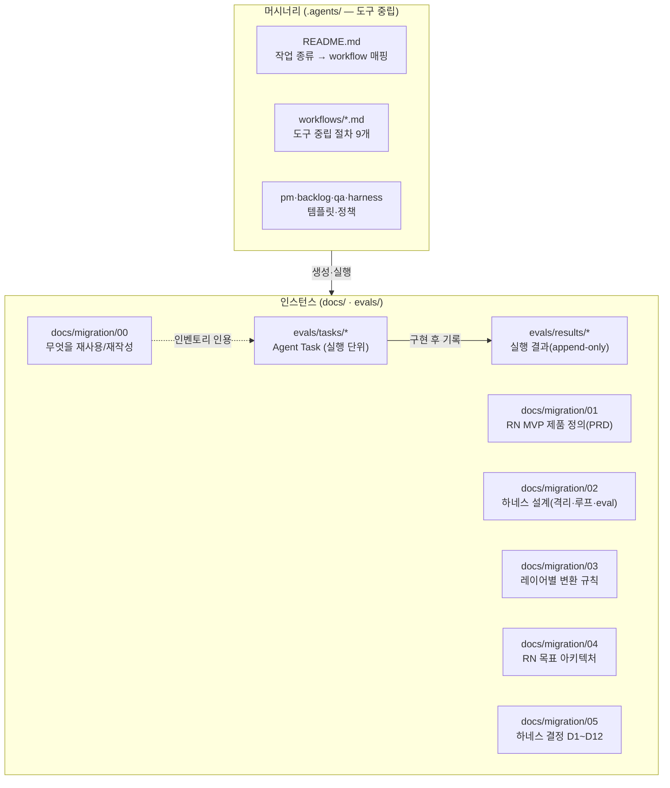
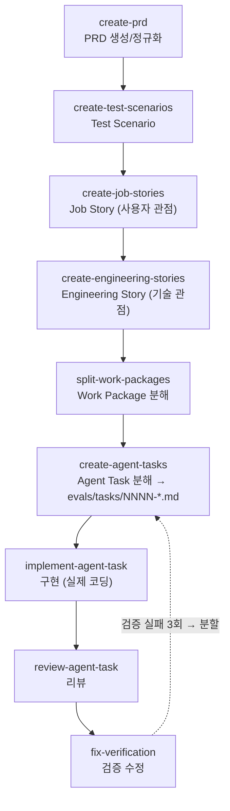
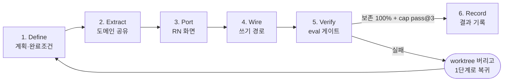
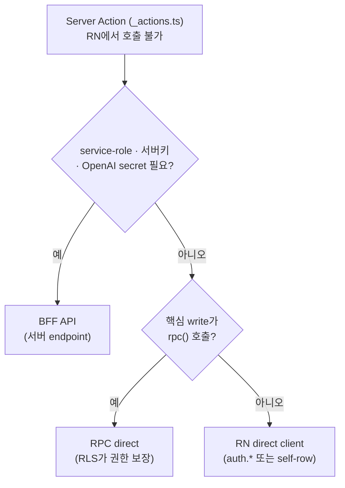
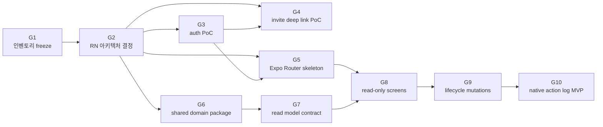

# RN 마이그레이션 — 전체 워크플로우 가이드

이 문서는 with-key를 **Next.js PWA(설치 가능한 웹앱)에서 Expo React Native(네이티브 앱)로 옮기는 작업 전체**를 처음 보는 사람이 따라 읽을 수 있게 정리한 진입점입니다. `docs/migration/` 폴더의 번호 문서(00~05)와 `.agents/`·`evals/`가 어떻게 맞물리는지를 그림과 함께 설명합니다.

> 약어: **PWA**(Progressive Web App, 브라우저로 설치 가능한 웹앱) · **RN**(React Native, 네이티브 앱 프레임워크) · **RLS**(Row Level Security, Postgres 행 단위 접근 제어) · **RPC**(Remote Procedure Call, Supabase Postgres 함수 호출) · **BFF**(Backend-for-Frontend, 클라이언트 전용 서버 API). 나머지는 맨 아래 [용어집](#용어집) 참조.

---

## 1. 한 줄 요약 (멘탈 모델)

> 지금의 PWA를 RN으로 옮기되, **화면·기능 하나하나를 "같은 절차 · 같은 검증"으로 반복**해서 옮긴다. 핵심 안전장치는 "PWA에서 잘 돌던 비즈니스 로직이 RN으로 옮긴 뒤에도 안 깨졌는가"를 매번 **자동 검사(eval)** 하는 것.

이삿짐을 한 박스씩 옮기는 것에 비유할 수 있습니다. 박스마다 **(1) 어디로 갈지 라벨 붙이고 → (2) 옮기고 → (3) 옮긴 뒤 깨진 게 없나 체크리스트로 확인**하는 표준 작업을 강제하는 시스템입니다. 이 "표준 작업 시스템"을 **마이그레이션 하네스(harness)** 라고 부릅니다.

---

## 2. 왜 이렇게까지 하나 — 세 가지 함정

RN 전환은 **화면 17개 + Server Action 30여 개**를 하나씩 옮기는 반복 작업입니다([00 §1·§9](./00-rn-conversion-plan.md)). 이 반복에는 구조적 위험이 셋 있습니다.

| 함정                         | 무슨 일이 벌어지나                                                                        | 왜 위험한가                                                                                |
| ---------------------------- | ----------------------------------------------------------------------------------------- | ------------------------------------------------------------------------------------------ |
| **① 비즈니스 로직 드리프트** | 옮기다가 벌금 누적·정산·done day 산정이 미묘하게 달라짐                                   | PWA와 RN이 **같은 Supabase DB·같은 사용자**를 공유 → 한쪽 계산이 틀리면 데이터가 직접 오염 |
| **② UX 의도 손실**           | "마감 전 1회만 사진 교체", "잔액 부족 시 서약 차단" 같은 **의도된 제약**이 재작성 중 누락 | 화면이 _뜨는 것_ 과 _의도대로 동작하는 것_ 은 다르다                                       |
| **③ 수작업 검증의 불안정**   | 매 기능마다 사람이 손으로 확인 → 빠뜨림·피로·비일관 누적                                  | "무엇을 통과로 볼지"가 글로 안 박혀 있으면 결과가 매번 흔들린다(비결정성)                  |

→ 이 셋을 막으려고 하네스를 만들었습니다. 하네스의 정의: **기능 1건마다 ① 격리된 작업 공간에서 ② 정해진 단계로 옮기고 ③ 보존 eval 게이트를 통과해야만 "완료"로 인정하는 반복 가능한 자동화 작업 환경.**

---

## 3. 문서 지도 — 무엇이 어디 있나

전환 관련 산출물은 **머시너리**(하네스를 _돌리는_ 도구)와 **인스턴스**(하네스가 _만든_ 결과물)로 나뉩니다([ADR-0031](../adr/0031-harness-structure-agents-home.md) — 머시너리는 tool-agnostic하게 `.agents/`에, 인스턴스는 `docs/`·`evals/`에).



`docs/migration/` 번호 문서의 역할:

| 문서                                                        | 역할                                            | 한 줄                                                                                      |
| ----------------------------------------------------------- | ----------------------------------------------- | ------------------------------------------------------------------------------------------ |
| [**00** rn-conversion-plan](./00-rn-conversion-plan.md)     | **무엇을** 재사용/재작성하나                    | 라우트·기능·로직을 "재사용 / 서버유지 / 재작성"으로 분류한 인벤토리(+ §13 freeze 매트릭스) |
| [**01** rn-mvp-prd](./01-rn-mvp-prd.md)                     | **무엇을** 만드나                               | RN MVP 제품 정의(P0 포팅 + P1 정산 + P2 자동검증)                                          |
| [**02** rn-migration-harness](./02-rn-migration-harness.md) | **어떻게 안정적으로** 빌드·검증하나             | 하네스 설계서(격리·루프·eval 3축)                                                          |
| [**03** rn-migration-rules](./03-rn-migration-rules.md)     | 각 레이어를 **어떤 라이브러리/패턴으로** 옮기나 | 레이어별 매핑 규칙                                                                         |
| [**04** rn-architecture](./04-rn-architecture.md)           | RN **목표 아키텍처**                            | [ADR-0033](../adr/0033-rn-target-architecture.md)으로 박제                                 |
| [**05** rn-harness-decisions](./05-rn-harness-decisions.md) | 02~04를 가로지르는 결정                         | 하네스 운영 결정 D1~D12                                                                    |

---

## 4. 실행 척추(spine) — 제품 요구사항에서 코드까지

[`.agents/workflows/`](../../.agents/workflows/)에 도구 중립 절차 9개가 있습니다. 큰 제품 요구사항을 **에이전트가 1패스로 실행 가능한 작은 작업(Agent Task)** 까지 단계적으로 쪼개 내려가는 파이프라인입니다.



**Agent Task(AT)** 가 이 워크플로우의 최소 실행 단위입니다. 한 파일(`evals/tasks/NNNN-<slug>.md`)에 다음이 들어있습니다([스키마 SoT](../../.agents/backlog/AGENT_TASK_TEMPLATE.md)):

- `Track`: **port**(기존 기능 포팅) vs **greenfield**(신기능) — 한 AT에서 섞지 않음(원칙 9·D2). **왜**: 포팅 AT에만 보존 eval을 적용하므로 섞이면 검증 기준이 모호해진다
- `Kind`: migration(닫히는 work-unit) vs regression(영속 baseline)
- `Parent`: 어느 PRD AC → Story에서 내려왔는지(추적성)
- `Status` / `Blocked-by`: 선행 작업 의존을 frontmatter로 인코딩(예: `G1-PoC θ 확정`)
- Source Files / Target Files / Acceptance Criteria / Verify 명령

> 구현 에이전트는 **AT 파일 딱 1개만** 받습니다(Story·PRD 통째 핸드오프 금지, D5). **왜**: 컨텍스트를 좁혀 비용을 줄이고, Target Files만 수정하는 surgical 작업을 강제하기 위해서입니다.

---

## 5. 하네스 3축 — 반복을 안전하게 만드는 장치

[02 문서](./02-rn-migration-harness.md)의 핵심입니다. 기능 하나를 옮길 때마다 세 가지가 강제됩니다.

| 축                      | 무엇                                        | 막는 함정                              |
| ----------------------- | ------------------------------------------- | -------------------------------------- |
| **A. 작업 환경(격리)**  | git worktree + 브랜치 + shared package 위치 | 실패한 시도가 main을 오염시키지 않게   |
| **B. 반복 루프**        | 한 기능을 옮기는 6단계 절차                 | 매 기능이 같은 절차를 타 결과가 일관됨 |
| **C. 보존 eval 게이트** | "완료"의 정의를 글로 고정                   | ①②③ 모두                               |

### 5.A 작업 환경 격리 (worktree + 모노레포)

- **1 기능 = 1 worktree = 1 브랜치**(`feat/rn-<feature>`). PR 베이스는 `develop`.
- worktree는 물리적으로 분리된 작업 디렉터리입니다. **절반 옮기다 막히면 통째로 버리고** 다시 시작할 수 있습니다. **왜**: RN 포팅은 "절반 옮기다 되돌리기"가 잦은데, 브랜치 전환은 작업 트리를 덮어쓰지만 worktree는 진행 중인 다른 작업을 보존합니다.

목표 모노레포 레이아웃([04 A1](./04-rn-architecture.md)):

```text
with-key/
├── apps/
│   ├── web/       # 현재 Next.js PWA (cutover까지 유지)
│   └── mobile/    # 신규 Expo RN 앱
├── packages/
│   └── domain/    # ★ 순수 TS 도메인 (validators·keywords·challenge·bank·share)
├── supabase/      # migrations·RLS·RPC (단일 SoT, 양쪽 공유)
└── evals/         # 검증 게이트
```

> **`packages/domain`이 1차 방어선**입니다. PWA와 RN이 **같은 도메인 코드 + 같은 unit test**를 import하면 비즈니스 로직 드리프트(함정 ①)가 **구조적으로 불가능**해집니다. "옮긴다"가 아니라 **"공유한다"** 가 핵심. _구조_(빈 패키지)는 한 번에 만들고, *내용*은 기능을 옮길 때마다 그 기능이 의존하는 모듈만 채웁니다.

### 5.B 기능 단위 6단계 루프

모든 기능이 똑같이 이 순서를 탑니다.



| 단계           | 하는 일                                                                                 | 다음 단계 진입 조건                                    |
| -------------- | --------------------------------------------------------------------------------------- | ------------------------------------------------------ |
| **1. Define**  | 보존할 도메인 규칙·UX 의도 목록화, eval task 초안                                       | 보존 항목이 글로 적힘                                  |
| **2. Extract** | 도메인 모듈을 `packages/domain`으로 이동(기존 test 동반)                                | web·RN 양쪽 typecheck + test 통과                      |
| **3. Port**    | Expo Router 화면 작성, 브라우저 전용(canvas·IndexedDB·service worker) → native API 교체 | RN 화면이 빌드·렌더됨                                  |
| **4. Wire**    | Server Action → RPC 직접 호출 또는 BFF API로 승격                                       | 쓰기 1건이 RLS 사용자로 성공, 우회 없음(reviewer 확인) |
| **5. Verify**  | 보존 eval + capability eval 실행                                                        | **보존 pass^k=100%** + **capability pass@3 ≥ 90%**     |
| **6. Record**  | `evals/results/agent-results.json`에 결과 append, 회귀 시 ADR 1건                       | append 완료, PR이 `develop`로 열림                     |

> **루프 불변식**: 5단계 보존 eval을 통과 못 하면 **화면이 떠도 "옮겨지지 않은 것"** 으로 봅니다. 이것이 함정 ①②를 막는 강제력입니다.

**왜 Server Action을 승격해야 하나?** RN은 Next.js의 `_actions.ts`(Server Action)를 호출할 수 없습니다. 그래서 모든 쓰기 경로를 셋 중 하나로 바꿔야 합니다([00 §13.2 분류 매트릭스](./00-rn-conversion-plan.md)):



### 5.C 보존 eval 게이트 (핵심 안전장치)

eval(평가)을 두 종류로 나눠 씁니다([eval-harness 스킬](../../evals/README.md)).

| eval 종류                    | 무엇을 재나                                  | 통과 기준                         | 의미                         |
| ---------------------------- | -------------------------------------------- | --------------------------------- | ---------------------------- |
| **① 보존 eval (regression)** | PWA 규칙·UX 의도가 포팅 후에도 동일한가      | **pass^k = 100%**(k=3, 모두 성공) | _제품_ 이 안 깨졌나 — 무관용 |
| **② capability eval**        | "옮겨라" 작업을 에이전트가 1-shot으로 해내나 | **pass@k ≥ 90%**(k=3, 1번 이상)   | _하네스_ 가 믿을 만한가      |

채점자(grader)는 대상에 따라 다릅니다. **왜 도메인은 결정론 우선**: 정산·벌금은 금전성이라 모델 채점의 모호함을 허용할 수 없습니다.

| 보존 대상                                   | 채점자                  | 구체 방법                                                             |
| ------------------------------------------- | ----------------------- | --------------------------------------------------------------------- |
| 순수 도메인(벌금·정산·done day·키워드)      | **결정론(코드 test)**   | `packages/domain` unit test를 web·RN 양쪽 실행 → 동일 입력 동일 출력  |
| read 계약(피드·대시보드·recap view model)   | **결정론(스냅샷)**      | 동일 fixture로 PWA·RN read 결과 JSON 스냅샷 비교                      |
| UX 의도(서약 차단·1회 교체·과반 반려)       | **모델 + 사람**         | acceptance 시나리오 모델 grader 1차, 경계는 `[HUMAN REVIEW REQUIRED]` |
| RLS 경계(클라 write 차단·service-role 격리) | **결정론(역할별 실측)** | anon·authenticated로 직접 read/write 시도 → 차단 확인                 |

결과는 `evals/results/agent-results.json`의 `runs[]`에만 **append**합니다(기존 항목·task 스펙 수정 금지 — 시점 비교 가능성 보존).

---

## 6. Phase 0~8 — 큰 일정과 의존 순서

전환은 8단계로 나뉩니다([00 §7](./00-rn-conversion-plan.md)). 각 Phase 완료는 "그 Phase에 속한 기능들의 6단계 루프 Verify 통과 합"으로 정의됩니다([02 §6.2](./02-rn-migration-harness.md)).

| Phase                       | 범위                   | 완료 조건                                                                                                                         |
| --------------------------- | ---------------------- | --------------------------------------------------------------------------------------------------------------------------------- |
| **0. Inventory**            | 코드 이동 전 설계 확정 | 모든 라우트·Server Action이 RN 처리 방식으로 분류 ✅ ([EVAL-0004](../../evals/tasks/0004-rn-phase0-inventory-freeze.md)로 freeze) |
| **1. Expo Foundation**      | RN 앱 부트스트랩       | dev build에서 login/logout/session restore/deep link 성공                                                                         |
| **2. Shared Domain**        | 순수 TS 재사용         | web·RN 양쪽이 같은 domain test 통과                                                                                               |
| **3. Read-only Parity**     | 읽기 화면              | RN에서 RLS 사용자로 핵심 read 화면이 실데이터 표시                                                                                |
| **4. Mutations**            | 쓰기 기능              | 모든 mutation이 RPC/API로 통과, RLS 우회 없음                                                                                     |
| **5. Native Photo & AI**    | 사진 인증              | 실기기에서 사진 인증 1건 + AI 일기 생성 + 피드 반영                                                                               |
| **6. Notifications**        | 푸시·알림센터          | 실기기 푸시 수신 + 알림 탭 navigation                                                                                             |
| **7. Recap/Share & Polish** | 종료·공유·설정         | Happy path E2E + 주요 실패 경로 통과                                                                                              |
| **8. Cutover**              | 운영 전환              | dogfood cohort가 RN으로 1주 챌린지 완주                                                                                           |

첫 10개 goal의 의존 순서(DAG — [00 §8](./00-rn-conversion-plan.md)). 순서 게이트는 각 Agent Task의 `Blocked-by` frontmatter로 인코딩합니다.



> 직렬 임계경로는 `G1→G2→G3→G5→G8→G9→G10`. G4(G3 후)·G6(G2 후)는 병렬 가능.

**선행 게이트(BLOCKING)**: P1 정산·P2 자동검증 관련 task는 아래 두 게이트 통과 전 `blocked`로 둡니다.

- **G1**: 부정탐지 false-flag 정밀도 PoC(실사진셋 평가)
- **G2**: 법무 검토(적립/번들 포인트) — 코드 게이트 아님

---

## 7. 검증 CLI (도구 무관)

기능을 옮기는 동안 도구(Claude·Codex·Cursor)와 무관하게 돌릴 수 있는 명령입니다.

> 현재 `harness:*`는 skeleton([02 spec §8])이며, 실제 검증 로직은 후속 코드 단계에서 채웁니다.

```bash
pnpm harness:context <task-id>   # 구현 전 컨텍스트 번들
```

```bash
pnpm harness:summarize-diff      # 구현 후 Task Summary
```

```bash
pnpm harness:check               # 결정론 추적성·구조 lint
```

```bash
pnpm harness:drift               # 7가지 drift 점검 → drift report
```

```bash
pnpm harness:verify              # typecheck · lint · test · check
```

---

## 8. 지금 어디까지 왔나 (2026-06-05 기준)

- **Phase 0 완료**: [EVAL-0004](../../evals/tasks/0004-rn-phase0-inventory-freeze.md)로 인벤토리 freeze → [00 §13](./00-rn-conversion-plan.md)에 결정론 매트릭스로 박제(라우트 24개·Server Action 24개·read 모듈 21개 분류 완료).
- **Agent Task 존재**: `0001~0003`은 옛 형식(grandfather, 소급 변경 없음), `0004~0010`이 RN 하네스 task.
- **진행 중**: 브랜치 `feat/rn-monorepo-foundation` — [EVAL-0010](../../evals/tasks/0010-rn-monorepo-foundation.md) 모노레포 골격(`apps/web` 이동) 작업 중.
- **eval 실행**: 아직 manual baseline 단계. 자동 harness는 후속 PR.

---

## 9. 더 읽기

| 알고 싶은 것                               | 문서                                                                                              |
| ------------------------------------------ | ------------------------------------------------------------------------------------------------- |
| 머시너리 진입점(작업 종류 → workflow 매핑) | [`.agents/README.md`](../../.agents/README.md)                                                    |
| 무엇을 재사용/재작성 + freeze 매트릭스     | [00-rn-conversion-plan](./00-rn-conversion-plan.md)                                               |
| RN MVP 제품 정의(PRD)                      | [01-rn-mvp-prd](./01-rn-mvp-prd.md)                                                               |
| 하네스 설계 상세                           | [02-rn-migration-harness](./02-rn-migration-harness.md)                                           |
| 레이어별 변환 규칙                         | [03-rn-migration-rules](./03-rn-migration-rules.md)                                               |
| RN 목표 아키텍처                           | [04-rn-architecture](./04-rn-architecture.md) · [ADR-0033](../adr/0033-rn-target-architecture.md) |
| 하네스 결정 D1~D12                         | [05-rn-harness-decisions](./05-rn-harness-decisions.md)                                           |
| eval 인프라 사용법                         | [evals/README](../../evals/README.md)                                                             |
| 머시너리/인스턴스 분리 근거                | [ADR-0031](../adr/0031-harness-structure-agents-home.md)                                          |

---

## 용어집

- **Agent Task(AT)**: 에이전트가 1패스로 실행 가능한 최소 작업 단위. `evals/tasks/NNNN-*.md` 한 파일. Track·Parent·Verify를 포함.
- **BFF (Backend-for-Frontend)**: 클라이언트 전용 서버 API. service-role·서버 키·OpenAI secret이 필요해 RN client가 직접 못 하는 쓰기를 여기로 승격.
- **capability eval**: "이 기능을 RN으로 옮겨라" task를 에이전트가 1-shot으로 해내는지 재는 평가(pass@3 ≥ 90%). 하네스 자동화의 신뢰성 측정.
- **보존 eval (regression)**: PWA에서 검증된 도메인 규칙·UX 의도가 RN 포팅 후에도 깨지지 않았는지 회귀 검사(pass^k=100%, 무관용).
- **EDD (Eval-Driven Development, 평가 주도 개발)**: 구현 전에 합격/불합격 기준(eval)을 먼저 정의하고 개발 중 지속 실행해 회귀를 조기 포착하는 방법론.
- **greenfield / port**: 신규 기능 / 기존 PWA 기능을 옮김. 보존 eval은 port에만 적용하므로 한 AT에서 섞지 않음.
- **마이그레이션 하네스**: 기능 1건을 RN으로 옮길 때마다 같은 격리·절차·검증을 강제하는 자동화 작업 환경. 3축 = 격리·반복 루프·보존 게이트.
- **머시너리 / 인스턴스**: 하네스를 _돌리는_ 도구(`.agents/`) / 하네스가 _만든_ 결과물(`docs/`·`evals/`).
- **packages/domain**: PWA와 RN이 공유하는 순수 TS 도메인 패키지. "옮긴다"가 아니라 "공유한다"가 비즈니스 로직 보존의 1차 방어선.
- **pass@k / pass^k**: k번 시도 중 1번 이상 성공 / k번 모두 성공. 신뢰성이 중요한 보존 게이트는 pass^k.
- **PWA (Progressive Web App)**: 브라우저로 설치 가능한 웹앱. 현재 with-key의 형태.
- **RLS (Row Level Security)**: Postgres 행 단위 접근 제어. RN client는 anon/authenticated 키로 RLS를 통과해 접근.
- **RPC (Remote Procedure Call)**: Supabase Postgres 함수 호출. RN은 Server Action을 못 써 쓰기 경로를 RPC로 승격.
- **RN (React Native)**: 네이티브 모바일 앱 프레임워크. 이 전환의 목표 스택(Expo SDK + Expo Router).
- **Server Action**: Next.js의 서버 측 쓰기 처리 함수(`_actions.ts`). RN에서 호출 불가 → RPC/BFF로 승격 대상.
- **spine(척추)**: PRD → Test Scenario → Job/Engineering Story → Work Package → Agent Task로 내려가는 분해 파이프라인.
- **worktree**: 같은 저장소의 물리적으로 분리된 작업 디렉터리. 진행 중 작업을 보존하며 격리 실험·되돌리기를 가능하게 함.
